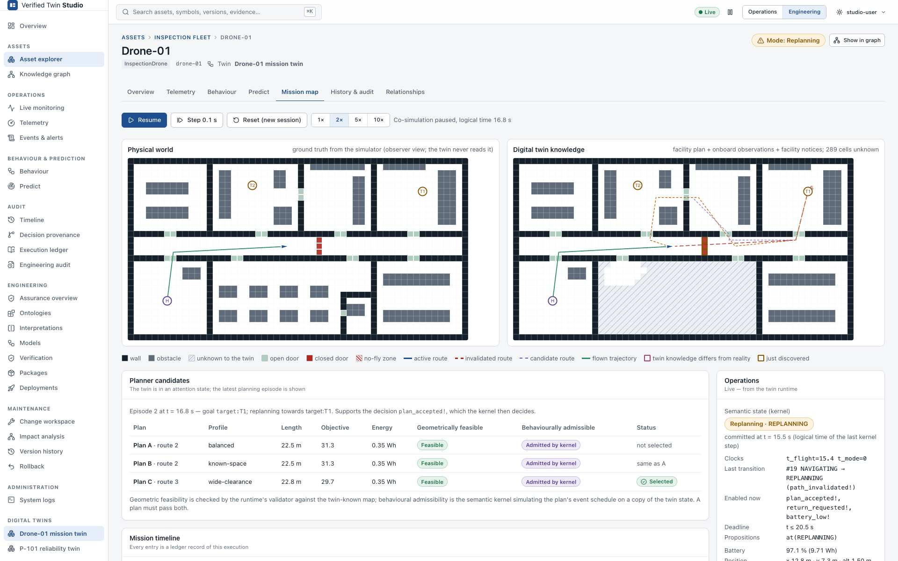

# Verified Twin Studio

**A domain-agnostic Digital Twin platform that combines live operations, semantic
interpretation, verified behavioural execution, prediction, planning, auditability and
semantic lifecycle management.** Every behavioural conclusion is computed by a small semantic
kernel. That kernel executes a model whose alignment with the physical system has been formally
verified, and every decision it takes is recorded in a tamper-evident ledger that anyone can
replay.



*Above: the indoor-inspection drone has just observed that fire door FD-2, which the facility
plan shows open, is closed. Its twin has invalidated the route and entered `REPLANNING`. The
planner has proposed three candidate routes, each checked for geometric feasibility on the
twin's **known** map and for behavioural admissibility by the **kernel**. Left: the physical
world (simulator ground truth). Right: what the twin knows.*

## Quick start

```bash
make demo
```

Then open **http://127.0.0.1:8080**. The first run builds the C++ engine and the web UI and seeds
two example twins; later runs start in seconds. In the UI, go to **Assets → Inspection fleet →
Drone-01 → Mission map** and press **Start mission**.

Requirements: macOS or Linux, CMake ≥ 3.25, a C++20 compiler, Node ≥ 20, Python 3, Z3
(`brew install z3`). `scripts/bootstrap-deps.sh` builds the pinned UPPAAL libraries (UTAP, UDBM)
on first use.

**macOS app.** `make macos-app` builds `dist/macos/Verified Twin Studio.app` and a `.dmg`. The app
is self-contained: it bundles every component and the only non-system library (Z3). Double-click
it, and it starts the whole product in the background and opens the browser. Its menu-bar item
offers Open, Show Data/Logs, Reset Demo Data and Quit; Quit stops every component. Data lives in
`~/Library/Application Support/Verified Twin Studio`. The app is signed ad hoc; to distribute it
to other Macs, sign it with a Developer ID and notarize it (see `scripts/macos/build-app.sh`).

## What happens in the demo

| | |
|---|---|
| 1. A mission starts | The twin of Drone-01 executes its verified mission-supervisor model: `READY → TAKING_OFF → NAVIGATING`. |
| 2. Partial knowledge | The twin knows only the facility plan. That plan is outdated: it shows fire door FD-2 open and does not know the refurbished office. |
| 3. Discovery | The drone's lidar sees the closed door. The building-information service publishes the observation, and the twin's map changes. |
| 4. Semantic consequence | The route is now invalid. The twin proposes `path_invalidated!`, and the **kernel** accepts it: `NAVIGATING → REPLANNING`. |
| 5. Planning | The untrusted planner proposes candidates A, B and C. Each is checked geometrically and by the kernel (its event schedule simulated on a copy of the state). |
| 6. Decision | `plan_accepted!` takes the twin `REPLANNING → NAVIGATING`, and the drone flies the new route. |
| 7. Second change | A facility notice declares a no-fly zone in the server room, which forces a second replan through the unmapped office. |
| 8. Completion | The drone inspects both targets, returns and lands. Every transition is in the ledger: **Verify ledger**, then **Replay mission**. |

The same generic screens also serve a second twin: an industrial process pump, monitored from
its control system's events and telemetry, with no domain-specific UI code.

## Architecture in one picture

```
 PHYSICAL SYSTEM ─ observations ─▶ TELEMETRY ─▶ SEMANTIC INTERPRETATION (label equivalence E from alignment)
                                                        │
                                                        ▼
                                   VERIFIED TWIN STATE (semantic kernel, logical time)
                                     │            │                     │
                                     ├─▶ PREDICTION (on copies)         │
                                     ├─▶ PLANNER (proposals only) ──────┤
                                     ▼                                  ▼
                              ACTION / EXECUTION ──────▶ TAMPER-EVIDENT LEDGER (hash chain, replay)

 ONTOLOGY + INTERPRETATIONS + PT/DT MODELS ─▶ FORMAL VERIFICATION (SemPTDTAlignmentICSE, Z3)
     ─▶ COMPILER (translation-validated) ─▶ VERIFIED PACKAGE (hashes + evidence) ─▶ DEPLOYED TWIN
```

| Process | Port | Role |
|---|---|---|
| `twin-studio` | 8080 | Platform API, persistence (SQLite + content-addressed store), web UI, runtime proxy |
| `twin-runtime` | 8090 / 8092 | One per twin: verified package → session → kernel → ledger; REST + SSE |
| `twin-world` | 8091 | Drone Physical Twin simulator and building-information service (ground truth lives here) |
| `twin-pt-feed` | – | Scripted pump control system (events + consistent telemetry) |

Details: [docs/architecture.md](docs/architecture.md).

## Formal assurance

The guarantee, in logical time:

```
V_D  ≅  IR(V_D)  ≅  K_sem(IR(V_D))  ~weak  K_prod(IR(V_D))
```

- The DT view `V_D` is verified to be semantically aligned with the PT view `V_P` under the domain
  ontology Φ, by **SemPTDTAlignmentICSE**.
- The **compiler** turns `V_D` into a canonical IR and checks its own reading against the
  aligner's reading of the same document (translation validation).
- The **semantic kernel** implements the timed-automaton semantics of the IR.
- The **production runtime** commits only kernel-computed states, writes the ledger before it
  commits (write-ahead), and fail-stops if it cannot.

The argument is in [`proof/`](proof) (handwritten, not mechanised). What has to be trusted is in
[docs/trusted-computing-base.md](docs/trusted-computing-base.md). There are no hard real-time
claims: see [docs/logical-time-model.md](docs/logical-time-model.md).

## Documentation

| | |
|---|---|
| [Demo script](docs/demo-script.md) | A 3–5 minute walkthrough for presenters |
| [Architecture](docs/architecture.md) | Processes, libraries, data flow, evidence |
| [Runtime API](docs/runtime-api.md), [OpenAPI](api/runtime.openapi.yaml) | REST and SSE contract of `twin-runtime` (narrative and machine-readable) |
| [Trusted computing base](docs/trusted-computing-base.md) | What must be correct, and what need not be |
| [Logical time](docs/logical-time-model.md) | The time model and why no real-time claims are made |
| [Supported model fragment](docs/supported-model-fragment.md), [compiler diagnostics](docs/compiler-diagnostics.md) | Which UPPAAL models compile, and why others are refused |
| [Aligner integration](docs/existing-aligner-integration.md) | How SemPTDTAlignmentICSE is reused, unmodified |
| [Integration audit](docs/integration-audit.md), [final report](docs/final-integration-report.md) | What exists, how it was integrated, limitations |
| [Studio manual](docs/studio/) | Using Verified Twin Studio (operations, engineering, maintenance) |
| [Screenshots](docs/screenshots/) | Captured from the running product (`scripts/capture-screenshots.sh`) |
| API reference | `make docs` → `build/docs/html/index.html` (Doxygen) |

## Development

| Task | Command |
|---|---|
| Whole product (build, seed, start) | `make demo` (`make demo-fresh` resets the demo data) |
| Engine only (CLI, runtime, simulators) | `cmake --preset release && cmake --build build/release` |
| Engine + Studio backend | `cmake --preset studio-release && cmake --build build/studio-release` |
| Frontend only (hot reload, proxies `/api` to :8080) | `cd web/studio && npm ci && npm run dev` |
| C++ tests (unit, integration, architecture, e2e) | `ctest --test-dir build/release` |
| Frontend tests | `cd web/studio && npm test` |
| Browser end-to-end (against a running demo) | `cd web/studio && npx playwright test` |
| Drone simulator only | `build/release/bin/twin-world --scenario scenarios/inspection_default.json` |
| Offline toolchain | `twin compile`, `twin align`, `twin package build/verify`, `twin ledger verify`, `twin replay` |
| API docs, proof | `make docs`, `make proof` |
| Screenshots | `./scripts/capture-screenshots.sh` (or `make screenshots`) |
| macOS app and disk image | `make macos-app` |

## Repository layout

```
include/twin/<module>/, src/<module>/   C++ libraries (core, json, ir, kernel, compiler, alignment,
                                        package, ledger, runtime, planner, geo, world, ptfeed,
                                        ontology, platform, studio)
apps/                                   twin, twin-runtime, twin-world, twin-pt-feed, twin-studio; macos/ (app launcher)
api/                                    OpenAPI contracts (runtime, Studio)
web/studio/                             Verified Twin Studio (React + TypeScript); plugins/drone
models/, examples/, scenarios/          drone models, Studio examples (drone, pump), simulator scenarios
SemPTDTAlignmentICSE/                   the semantic aligner (unmodified)
tests/                                  unit, integration, architecture, e2e (GoogleTest); Studio suites
proof/                                  correctness argument (LaTeX)
docs/                                   documentation and screenshots
```

## Limitations

- **Logical time only.** No physical hard-real-time equivalence is claimed.
- **Handwritten proof.** The proof is not mechanised. The tests validate the implementation;
  they do not prove it.
- **Tamper-evident, not immutable.** The ledger makes changes detectable. Immutability would need
  WORM storage or external anchoring (`twin ledger anchor`).
- **Simulated physical side.** The Physical Twins are simulated (drone) or scripted (pump).
- **No authentication.** Studio has none in this version: the role selector only adjusts
  disclosure depth.

See [docs/final-integration-report.md](docs/final-integration-report.md) for the complete list.
