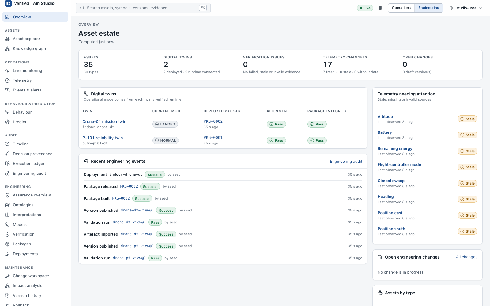

# Verified Twin Studio — product manual

Verified Twin Studio is where digital twins are designed, verified, released and operated. It
works for any twin: the drone, the industrial pump and the thermal chamber that ship as examples
use the same generic screens. Only the drone adds a domain view, and it does so through a plugin.

It has two modes:

- **Studio** — design a type of twin as a **Twin Blueprint**: its structure, world and layout,
  data contract and connectivity, the Physical System View and the Digital Twin View, the
  ontology and interpretations, requirements and monitors, scenarios; verify it; release it as a
  Verified Core Package plus a Deployment Bundle; create and deploy its instances. Start with
  [Build Your First Twin](tutorial-first-twin.md).
- **Operate** — run and monitor the instances: live state, telemetry and meaning, behaviour and
  conformance, monitors and alerts, prediction, audit and replay.



## One rule above all

**The browser displays conclusions. It never makes them.**

Every behavioural state, proposition, admissible transition, prediction, conformance verdict,
ledger verdict, validation result, refinement verdict and impact classification shown in Studio
comes from an authoritative backend component:

| Conclusion | Decided by |
|---|---|
| Behavioural state, enabled transitions, predictions, what-if | the verified kernel (`twin-runtime`) |
| Meaning of telemetry (proposition truth) | interpretation evaluation with Z3 in `twin-studio` |
| Ontology / interpretation validity | the strict parser **and** SemPTDTAlignmentICSE's parser plus Z3 |
| Ontology refinement (Def. 4) | `twin::ontology::check_refinement` (Z3, three-valued) |
| Alignment preservation (Theorem 3) | `assess_preservation`, applied only when every premise holds |
| Semantic alignment | SemPTDTAlignmentICSE (via the compiler) |
| Package integrity | the package verifier |
| Ledger validity | the runtime's ledger verifier |
| Event timing windows, scenario step verdicts | the semantic kernel, on the compiled Digital Twin View |
| Blueprint section validity, release gate, impact of a version | the Blueprint service, from evidence for exactly the version's inputs |
| Live monitor results | the runtime (conformance), the property evaluator on the kernel's state, the telemetry store (data quality) |

A trust badge is never green by default. The badge states are **Pass**, **Fail**, **Unknown**,
**Not checked**, **Stale**, **Invalidated**, **Check running**, **Unavailable** and
**Check failed**. Each state has its own icon and label, so the meaning never depends on colour
alone. A badge that has not been checked shows **Not checked**. Anything the client cannot
parse shows **Unknown**, never Pass.

## The loops

```
OPERATIONS:   asset → telemetry → semantic meaning → verified behaviour → prediction → decision → evidence
ENGINEERING:  ontology/model/interpretation → edit → validate → refinement/alignment → impact
              → compile → verified package → deploy → operate → maintain → new version
DESIGN:       blueprint → structure · world · data → PT/DT views → ontology · interpretations
              → requirements · monitors · scenarios → verify → release → instances → deploy
```

## Contents

| Page | For |
|---|---|
| [Getting started](getting-started.md) | Starting the demo, the layout, personas, search, live data and time |
| [Tutorial: Build Your First Twin](tutorial-first-twin.md) | A thermal chamber twin from nothing to a monitored instance, with real screenshots |
| [Twin Blueprints](blueprints.md) | Blueprints and instances, versions, the separate models, verified core vs. deployment bundle, status words, the Studio home, the five ways to create a twin, the wizard |
| [The Blueprint workspace](blueprint-workspace.md) | Every editor: structure, world & layout, data & connectivity, presentation, the PT/DT views, ontology, interpretations, cross-layer binding, requirements, monitors, alignment, verification |
| [Scenarios and preview](scenarios-and-preview.md) | The Scenario Builder with the kernel's timing windows, illegal steps, running scenarios, the isolated Studio preview |
| [Release, instances and deployment](blueprint-release.md) | The release gate, package and bundle, publishing, instances, the deployment supervisor, live monitors in Operate |
| [Operations](operations.md) | Assets, knowledge graph, telemetry and meaning, behaviour, conformance, events, prediction, what-if, planning |
| [Audit, provenance and replay](audit-and-replay.md) | Execution ledger, chain verification, decision provenance, replay, historical reproducibility |
| [Ontology management](ontology-management.md) | Formal ontology vs. asset knowledge graph, the editor, versioning and lifecycle, diff, interpretation editing |
| [Refinement checking](refinement.md) | Definition 4, running a check, understanding the four results, evidence, Theorem 3 |
| [Impact analysis and staleness](impact-and-staleness.md) | Dependency analysis, impact classes, evidence staleness, re-running alignment |
| [Releases, deployment and rollback](release-and-deployment.md) | Change workspace, release pipeline, packages, deployment, rollback, engineering audit, logs |
| [Tutorial: Safely evolving an ontology](tutorial-evolving-an-ontology.md) | The whole engineering loop on the pump, with real screenshots |
| [Domain plugins](plugins.md) | Writing a domain visualisation (developer guide) |
| [Developer guide](developer.md) | Architecture, API contract, building, testing, security notes |
| [Aligner findings](aligner-findings.md) | Behaviour of SemPTDTAlignmentICSE that Studio compensates for |

The runtime API is documented in [`../runtime-api.md`](../runtime-api.md). The Studio HTTP
API is specified in [`../../api/studio.openapi.yaml`](../../api/studio.openapi.yaml).
