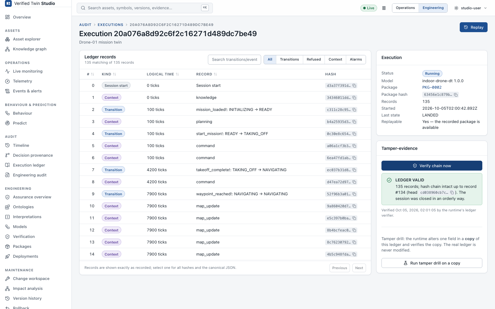
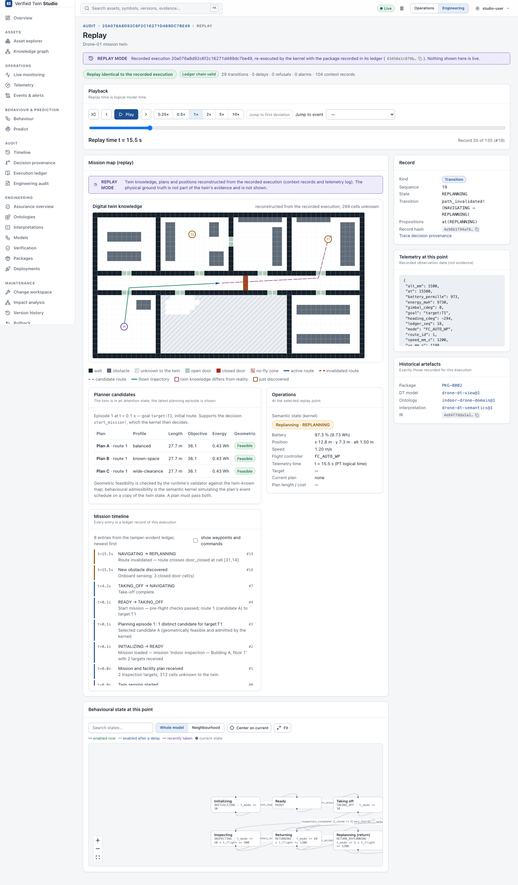

# Audit, provenance and replay

Studio keeps two separate audit trails:

| | Execution ledger | Engineering audit |
|---|---|---|
| Records | runtime behaviour (every semantic step) | artefact and lifecycle changes |
| Kept by | each `twin-runtime`, per execution | `twin-studio` (SQLite) |
| Integrity | hash chain, verified by the runtime | hash chain, verified by Studio |
| Page | Audit → Execution ledger | Audit → Engineering audit |

Application logs (Administration → System logs) are diagnostics. They are neither evidence
nor part of either trail.

## Execution ledger

**Audit → Execution ledger** lists the executions of a twin, each with:
- status (running, closed, not closed)
- the package it ran
- the record count and the last state

An execution page shows its records in order, with filters by kind, transition/event text
and time. A record shows:
- sequence number and execution id
- logical time before → after
- source state, event, transition and destination state
- proposition changes
- input digest
- package hash and model, ontology, interpretation and IR hashes (from the package manifest)
- previous record hash and record hash



### Verifying the chain

**Verify chain now** asks the runtime's ledger verifier to recompute the chain. The result is:
- **LEDGER VALID**: only after a verification run in this view succeeded. It shows the number
  of records, the head hash and when it ran.
- **LEDGER INVALID**: shows the **first invalid record** and the reason, for example *content
  modified: the record no longer matches its hash* or a broken predecessor link.
- **Not verified in this view** until you run it. Studio never assumes validity.

**Audit → Engineering audit → Verify** does the same for the engineering trail.

## Decision provenance

**Audit → Decision provenance** answers *why did this happen?* It works backwards from an
event, transition, alert, planner decision or deviation:

```
decision / event  →  behavioural transition (ledger record #n)  →  propositions that enabled it
→ interpretation entry  →  ontology version and axioms  →  observations (value, source, time)
→ asset / sensor  →  model, package and deployment
```

Every step comes from stored evidence: the ledger record, the package manifest, the
interpretation and ontology versions bound in that package, and the recorded telemetry. If a
link is not recorded, the chain says so instead of guessing.

## Replay

**Replay** re-executes a recorded execution:
1. The runtime loads **the package recorded in the ledger**, not whatever is running now.
2. It verifies the chain.
3. It re-runs every input with a fresh kernel and compares each recomputed record with the
   recorded one.

The page shows **REPLAY MODE**, plus *Replay identical to the recorded execution* (or the
mismatches) and the chain verdict.



| Control | Purpose |
|---|---|
| ⏮ ◀ ▶ | Back to start, step backward, step forward |
| Play / Pause, 0.25×–10× | Advances **logical replay time** at that speed |
| Scrubber | Jumps to any record |
| Jump to event / Jump to first deviation | Navigates the timeline |

These views are synchronised to the replay position:
- the record (state, transition, propositions)
- the telemetry recorded at that point
- the behavioural graph (state and the transition just taken)
- the domain plugin's view, if any

Context records (for example the drone's map updates) carry no state. The state shown is the
state of the last record that had one.

## Historical reproducibility

The **Historical artefacts** panel of a replay lists the exact package, DT model, ontology,
interpretation and IR hash recorded for that execution. Packages are immutable and published
versions are never edited, so an execution from months ago replays with **the semantics it
used then**. It does not use today's ontology.

The [tutorial](tutorial-evolving-an-ontology.md#10-old-executions-keep-their-semantics)
demonstrates this: after `process-pump@3` is deployed, an old execution still shows
`process-pump@1` and PKG-0001.

## Exports

| What | Where | Content |
|---|---|---|
| Execution ledger | Execution page → *Export ledger (JSON)* | Every record of the execution, as returned by the runtime (`seq`, `kind`, `hash`, `body`) |
| Evidence | Evidence and refinement pages → *Export evidence (JSON)* | The evidence record with its inputs, hashes, checker identity and full document |
| Telemetry | Telemetry → *CSV* / *JSON* | Observation time, ingestion time, value, quality (and min/max/count for downsampled buckets) |
