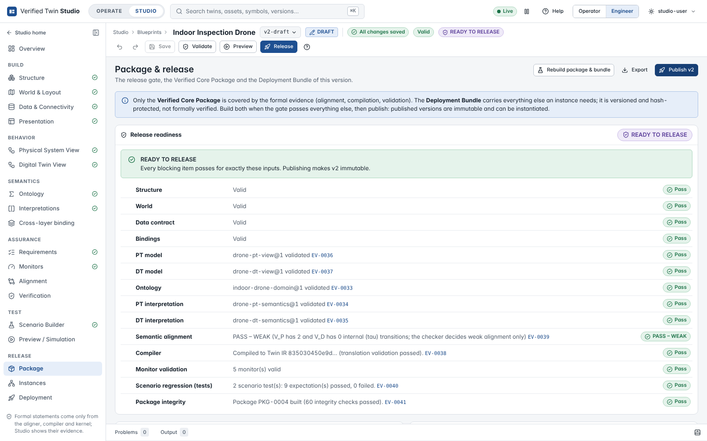
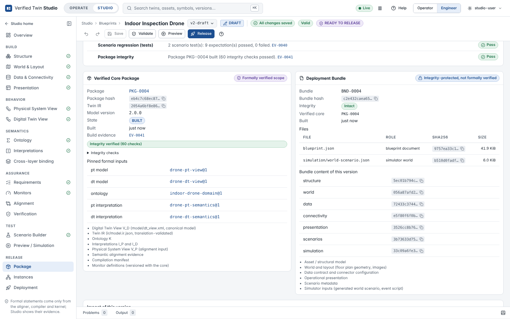
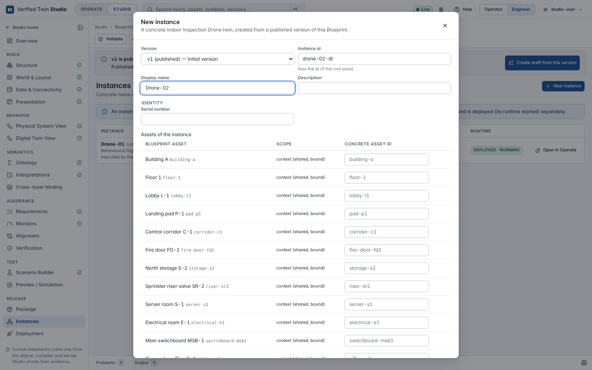
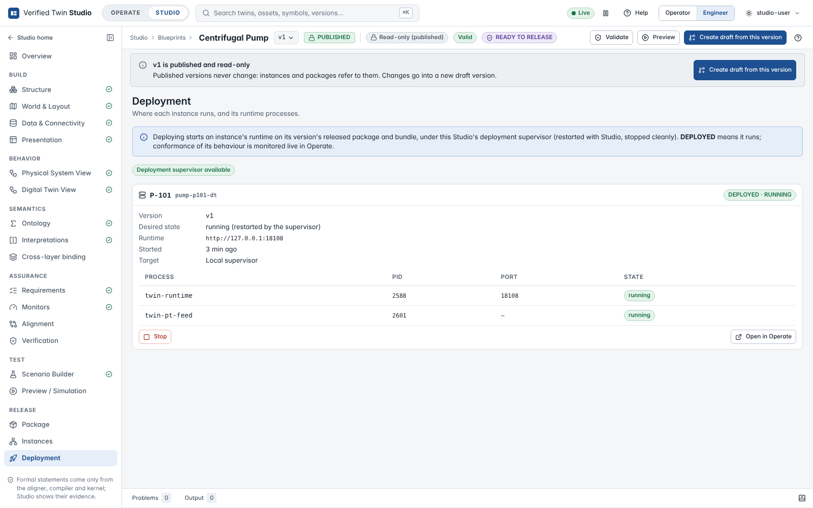
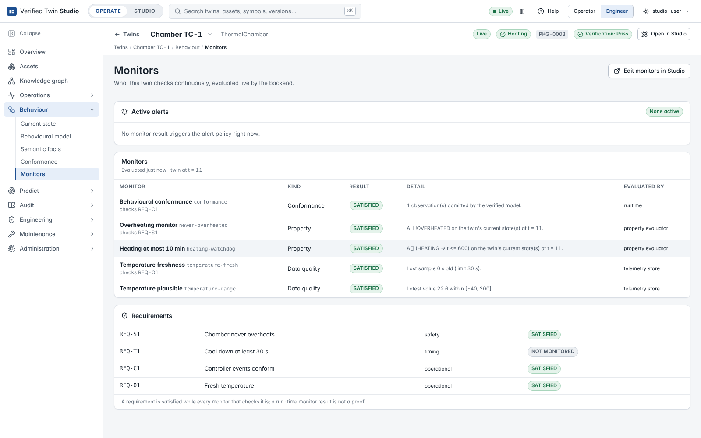

# Release, instances and deployment

## Release → Package

**The release gate** lists every item a release depends on, each computed from evidence for
exactly the version's inputs (the pinned artefact versions and the Blueprint document):

| Item | Passes when |
|---|---|
| Structure, World, Data contract, Bindings | the section validates (warnings allowed) |
| PT model, DT model, Ontology, PT / DT interpretation | the pinned version is **VALID** |
| Semantic alignment | the aligner's verdict is PASS (weak or strong) |
| Compiler | the DT view compiled with translation validation |
| Monitor validation | the monitors validate against the views and the data contract |
| Scenario regression (tests) | the scenario tests pass (not applicable without scenarios) |
| Package integrity | the Verified Core Package and the Deployment Bundle are built and intact |

**READY TO RELEASE** needs every blocking item to pass; otherwise **RELEASE BLOCKED** lists the
blockers, each with a **Fix** link. **Build package & bundle** is offered once everything except
the package passes.

The **Verified Core Package** (formally verified scope: package and IR hashes, model version,
integrity checks, the pinned formal inputs) and the **Deployment Bundle** (integrity-protected,
not formally verified: its files with role, hash and size, and the hash of every section of the
Blueprint document) are shown side by side. **Export** downloads the version as a
`twin-blueprint-bundle/1` document that another Studio can import.

**Impact of this version** compares the version with its parent: which sections changed, whether
each change touches the verified core, the deployment bundle, tests or presentation only, and
what must be re-run (alignment, compilation, package) — a presentation-only change invalidates
no formal evidence.

**Publish** makes the version immutable, publishes the pinned formal drafts and marks the
package released. It is refused while the gate does not pass.

## Release → Instances

An instance is created from a **published** version:

- its **id** (also the id of its root asset) and display name;
- **identity** values (per-instance properties such as a serial number);
- **assets**: every instance-scoped asset is created (ids derived from the instance id unless
  given); every context asset is bound to an existing estate asset (created if missing);
- **placement** of the root asset in the estate hierarchy;
- the **deployment target** (this Studio's supervisor).

Telemetry channels are created from the data contract, bound as the Blueprint's connectivity
says. An instance whose Blueprint has a newer published version shows **Upgrade**.

## Release → Deployment

**Deploy** starts the instance's runtime under the deployment supervisor of this Studio, on its
version's released package and bundle: `twin-runtime` (plus `twin-world` for co-simulation, or
`twin-pt-feed` for an event-script simulator), with a bridge that brings its telemetry into
Operate. The processes run in their own process group and are stopped cleanly (SIGTERM, then
SIGKILL after a grace period) when the instance is stopped or Studio exits; processes left behind
by a crash are found by their pid files and stopped before the instance starts again. A runtime
that exits unexpectedly is shown as **FAILED** with the reason and is **never restarted
automatically** — a fail-stop (the ledger could not be written, for example) is an integrity
event an operator must see. After Studio restarts, an instance shows **NOT DEPLOYED** until
**Deploy vN** deploys it again.

Each instance shows its processes, ports and state; **Stop** / **Start**, **Upgrade to vN** and
**Deploy another version…** (upgrade or rollback) change it, and **Open in Operate** opens the
running twin.

## In Operate

- **Open in Studio** (twin header) opens the Blueprint version the instance runs.
- **Behaviour → Monitors** shows the live result of every monitor, the alerts the alert policy
  raises now and the status of each requirement. Each monitor is evaluated by its authority:
  conformance by the runtime, property monitors on the kernel's committed state (with the model
  of exactly that version), data-quality monitors on the stored telemetry. A monitor that cannot
  be evaluated — the runtime is not running, a property uses semantic atoms, no sample has
  arrived — is **UNKNOWN** with the reason, never a guessed verdict.

