# The Blueprint workspace

Every Blueprint version opens in its own workspace: `/studio/blueprints/<id>/v/<version>`.

- **Left navigation** — Overview; **Build** (Structure, World & Layout, Data & Connectivity,
  Presentation); **Behavior** (Physical System View, Digital Twin View); **Semantics**
  (Ontology, Interpretations, Cross-layer binding); **Assurance** (Requirements, Monitors,
  Alignment, Verification); **Test** (Scenario Builder, Preview / Simulation); **Release**
  (Package, Instances, Deployment). Each entry carries the state of its section (complete,
  warnings, errors, empty) as an icon, not only a colour.
- **Top bar** — the Blueprint, the version switcher, **DRAFT** / **PUBLISHED**, the save state,
  the validation chip, the release verdict, and **Undo**, **Redo**, **Save**, **Validate**,
  **Preview**, **Release** (on a published version: **Create draft from this version**).
- **Bottom drawer** — **Problems** (every finding of every section; click one to open the element
  it concerns) and **Output** (every check run in this session, with its evidence).

## Editing safely

- **Autosave.** Edits are saved about a second after you stop typing; **Save** (Ctrl+S) saves
  now. The save state is always visible: *All changes saved*, *Unsaved changes*, *Saving…*,
  *Save failed*, *Changed elsewhere*.
- **No silent overwrite.** Each save carries the revision it was based on. If someone else
  saved first, Studio shows *Changed elsewhere*, keeps your edits on screen and lets you reload.
- **Undo / redo.** Ctrl+Z, Ctrl+Shift+Z or Ctrl+Y, across sections; rapid typing is one step.
- **Leaving with unsaved edits** asks first.
- **Renames follow references.** Renaming an asset, a signal, an event, a monitor or a
  requirement updates every reference to it in one undoable step.
- **Deleting shows dependencies.** The confirmation lists everything that refers to the element.

## Build → Structure

Asset **types** (with typed property schemas), the **assets** of the twin type and their
**relationships**. The root asset is the twin itself; *instance-scoped* assets are created for
every instance; *context* assets (the lab, the line, the building) are shared and bound to
existing estate assets when an instance is created. The **Graph** tab draws the hierarchy and
relationships.

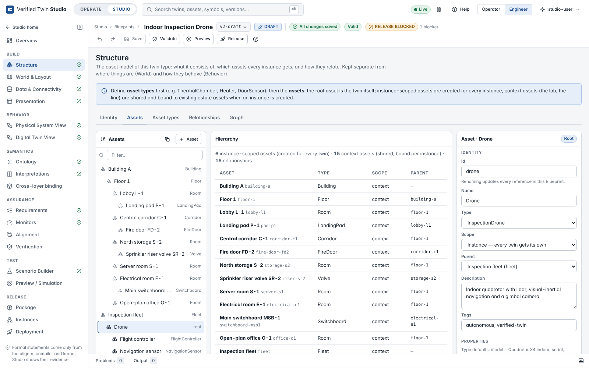

## Build → World & Layout

Where the twin lives. A world is a **spatial** map (integer millimetres), a **topology** or a
**diagram**. Tools (key in brackets): Select (V), Pan (H), Point (P), Line (L), Polyline (Y),
Rectangle (R), Polygon (G), Region (E), Text (T), Waypoint (W), Node (N), Connector (C), plus the
domain palette (walls, doors, obstacles, no-fly zones, rooms, inspection targets, pumps, valves,
tanks…) and **asset placement** for binding an object to an asset. Zoom with the wheel, pan with
Space+drag; grid with snapping; alignment guides; multi-select (Shift); duplicate (Ctrl+D);
delete; arrow keys nudge; undo/redo. **Import** brings in a background image (PNG, JPEG, SVG),
GeoJSON or a `twin-world/1` document.

Layers have roles. **Ground truth** layers hold what physically exists; **twin knowledge**
layers hold what the twin is told at start (an outdated plan, for example). The view switch shows
*All layers*, *Ground truth* or *Twin knowledge*, and **Ground truth vs knowledge (simulator)**
shows the grids the backend rasterises for the simulator — the cells where they differ are what
the twin can only learn by observation.

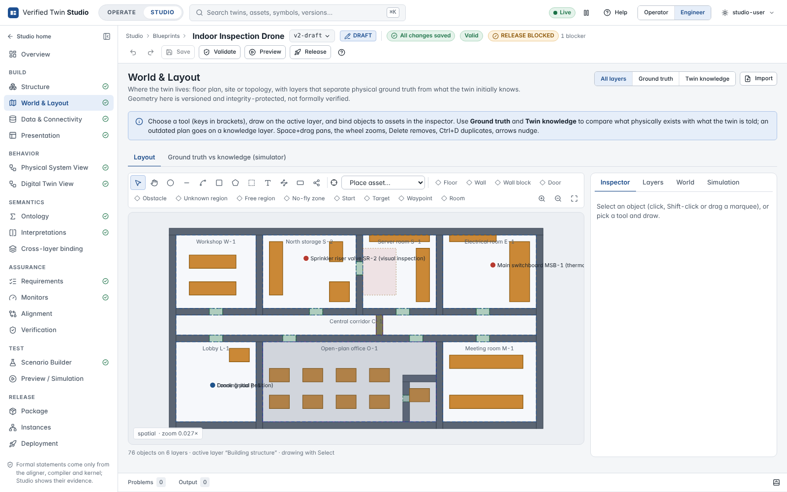

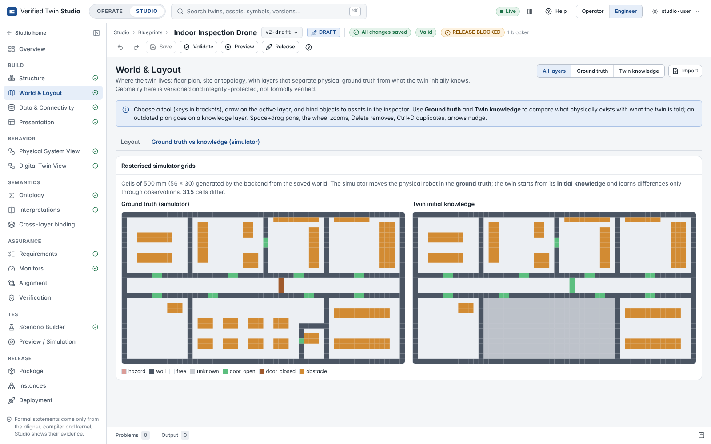

## Build → Data & Connectivity

The **data contract**: static properties (per instance, e.g. a serial number), telemetry signals
(type, unit, asset, expected period, plausible range, the **ontology symbol** the signal
observes), events (payload, the **formal labels** of the event in the PT and DT views) and
commands (parameters, acknowledgement and observed consequence with time-outs).

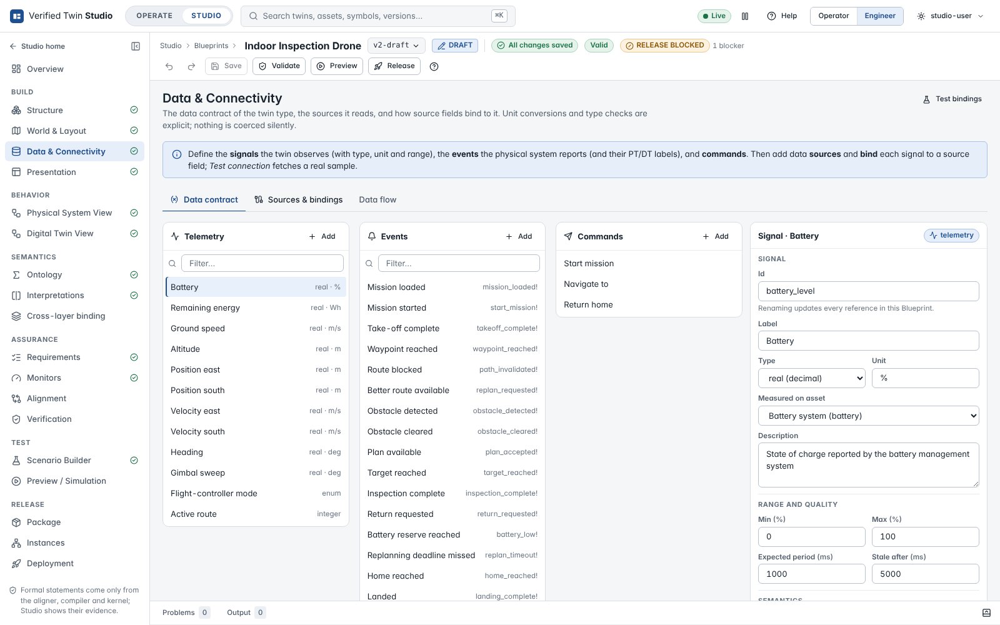

**Connectivity** declares the sources (MQTT, OPC UA, REST, simulator, replay, file) and binds each
signal to a source field with an optional unit conversion. **Test connection** reads the source
once and shows the raw value, the converted value and whether its type matches — nothing is
stored. The **Data flow** tab draws source → binding → signal → symbol → asset.

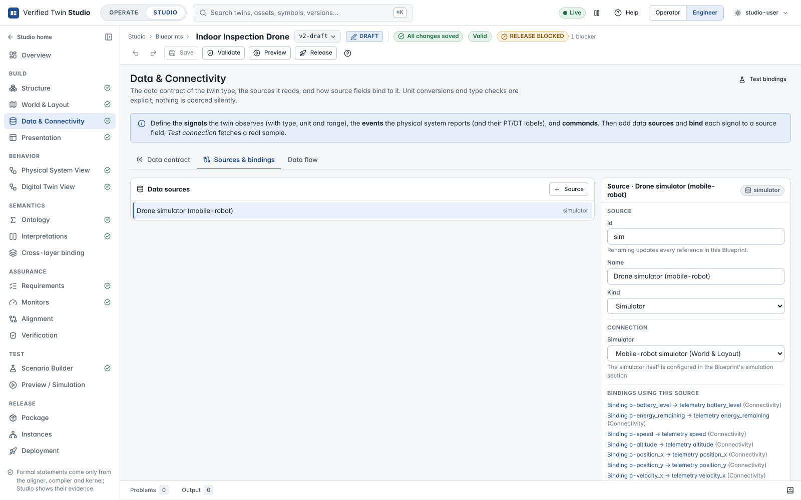

## Build → Presentation

Operator-facing names and tones of the Digital Twin View states, labels of its events, key
signals, important assets and monitors, charts. It has **no formal effect**: changing it
invalidates no evidence.

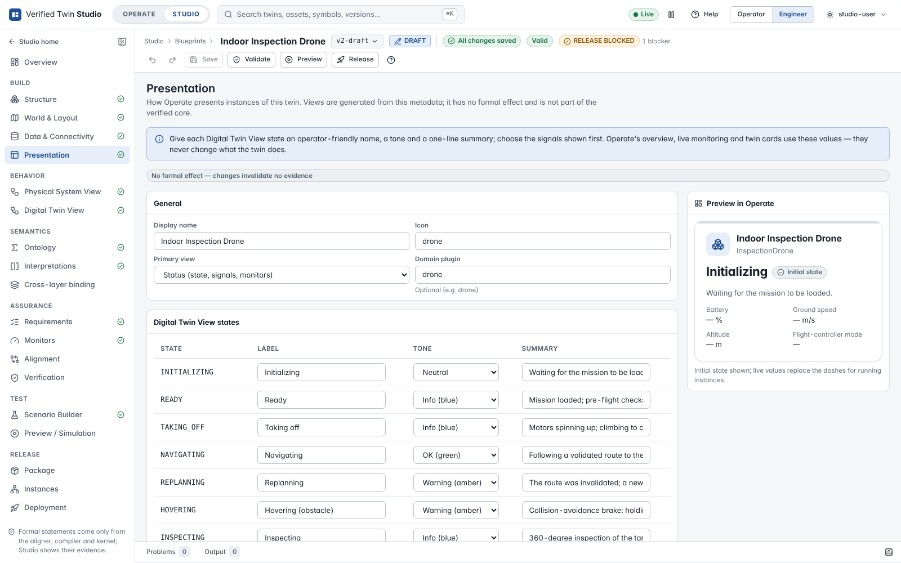

## Behavior → Physical System View and Digital Twin View

One editor for both timed automata, on one canonical model (`twin-ta/1`). Locations are boxes
(the initial one marked; invariants shown), transitions are edges with their guard, event and
resets; self-loops and parallel transitions are drawn apart. Drag from a location's handle to
create a transition, double-click the background to add a location, drag to move; the
**inspector** edits names, invariants, guards (parsed by the backend as you type), events and
resets, and lists where an element is used. **TwinTA text** shows and edits the same model as
text. **Import** accepts UPPAAL XML (flat, single template), TwinTA or canonical JSON; constructs
outside the supported fragment are listed and nothing is imported. **Export** renders TwinTA,
JSON or UPPAAL XML. Structural diagnostics come from the backend validator.

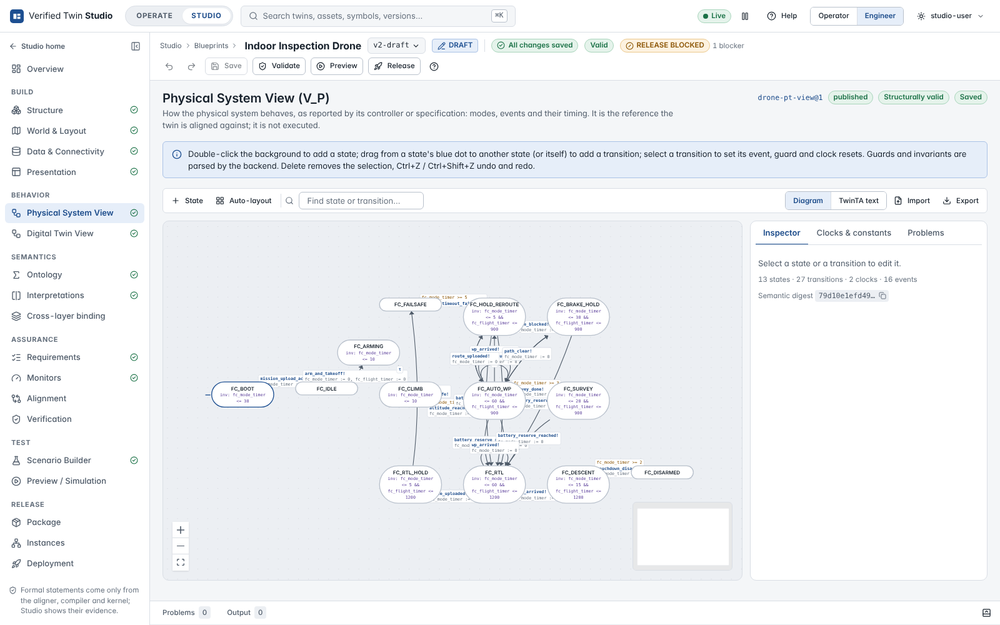

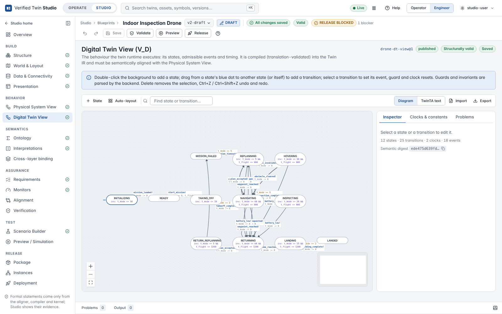

## Semantics → Ontology

The domain theory K — sorts, functions, relations, axioms — with the strict parser's located
diagnostics, autocompletion, the parsed structure (click to jump), validation evidence,
**Use existing version** (reuse a shared ontology), **Import file**, **Compare** with another
version, and **Check refinement vs. published version** (Definition 4, decided by Z3).

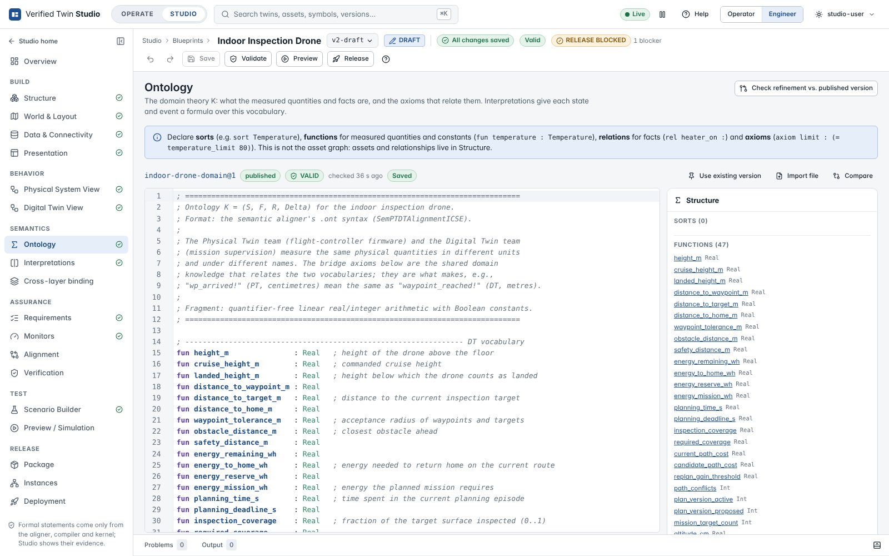

## Semantics → Interpretations

I_D (Digital Twin View) and I_P (Physical System View): the meaning of every location and event
as a formula over the ontology. **Coverage** lists every state and event of the view as mapped,
unmapped or invalid; **Insert commented templates** adds an entry for each missing one. An
interpretation needs the ontology first.

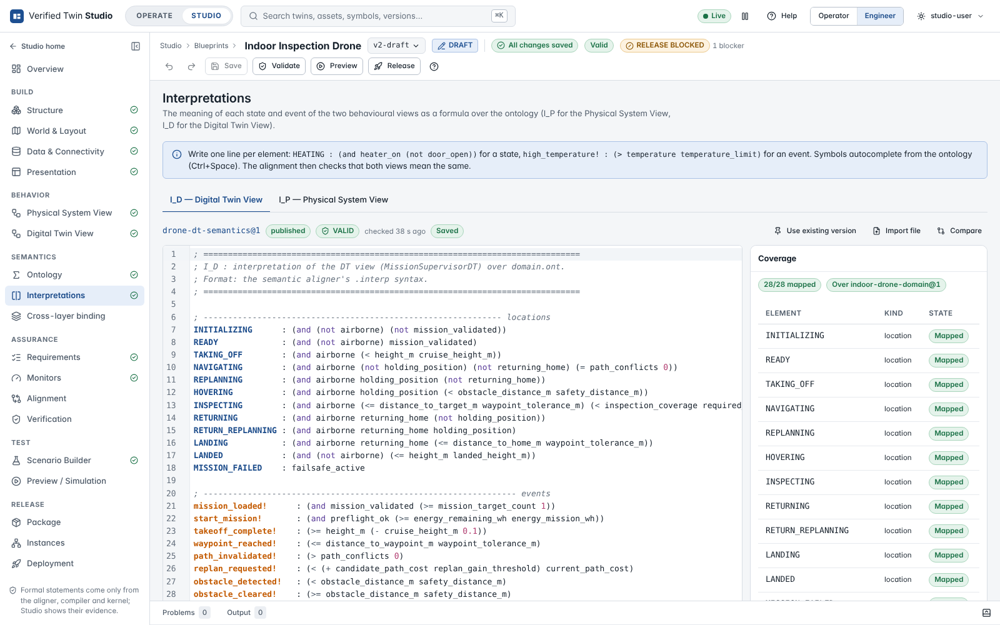

## Semantics → Cross-layer binding

Every signal and event read across **World → Data → Semantics → Behavior**: the world object of
its asset, the source and binding that deliver it, its ontology symbol (or formal labels), and
the DT/PT states and events whose interpretation uses it. A missing link is highlighted with a
**Fix** link to the editor that closes it; ontology symbols no signal observes are listed too.

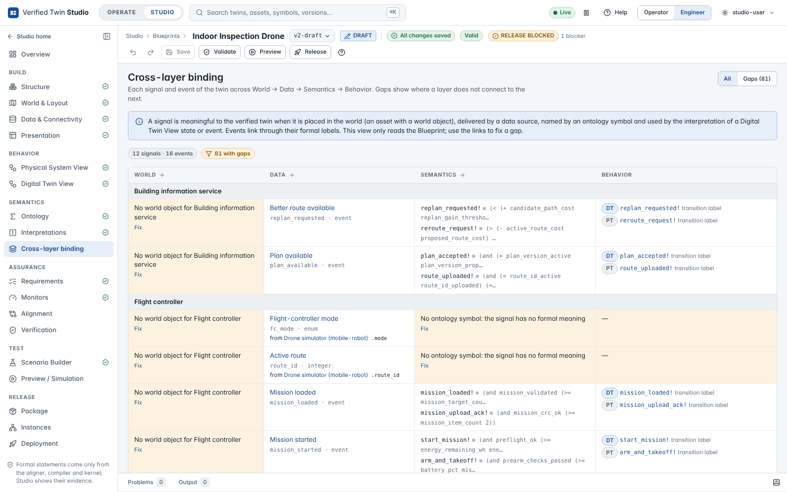

## Assurance → Requirements

Requirements in plain words (category, severity, description), traced to the monitors that check
them, with an optional formal statement over the Digital Twin View. The backend's property
analysis says whether a statement can be **checked at design time** and **monitored at run
time**. **Coverage** is the requirement × monitor matrix; unmonitored requirements are flagged.

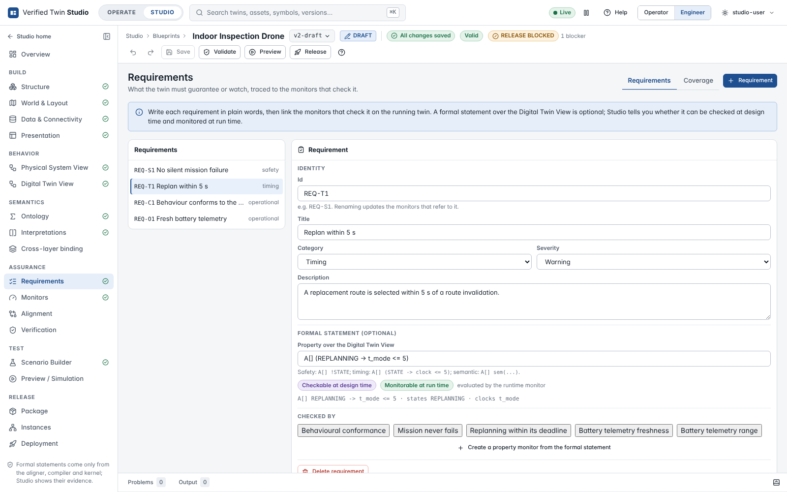

## Assurance → Monitors

Three kinds of monitor, each validated by the backend against the pinned views and the data
contract:

- **Behavioural conformance** — every observed event must be admitted by the verified model
  (all events or chosen PT labels; record or reject what is not admitted);
- **Temporal property** — e.g. `A[] !FAULT` (never reach a state) or `A[] (STATE -> t <= 600)`
  (bounded time in a state); a builder composes them from the view's states and clocks, the
  property analysis explains what can be checked, and **Check now** runs the design-time checker
  on the DT view (HOLDS / VIOLATED with a witness run / INCONCLUSIVE);
- **Data quality** — stale, missing, invalid type, out of range, clock regression, duplicate,
  disconnected.

The **alert policy** maps monitor results (violated, finding, inconclusive) to alerts with a
severity and the message operators see.

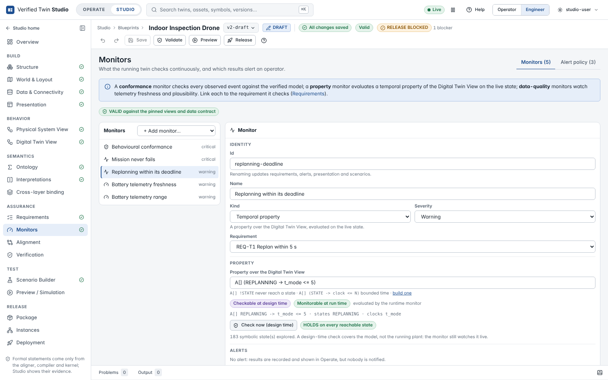

## Assurance → Alignment

The aligner's verdict on exactly the pinned views, ontology and interpretations (semantic
alignment, Definition 5): **PASS / FAIL / UNKNOWN / ERROR**, **weak** and **strong** alignment
(strong is UNKNOWN when a view has internal τ transitions), the label equivalence E and the
location correspondence it found, the counterexample of a failure, findings linked to model
elements, lint findings, the input and compiled-view hashes, the aligner's identity and the run's
duration. **Why?** / **Explain a pair** asks the aligner (Z3 over the ontology) whether
I_P(a) ↔ I_D(b) holds and in which direction.

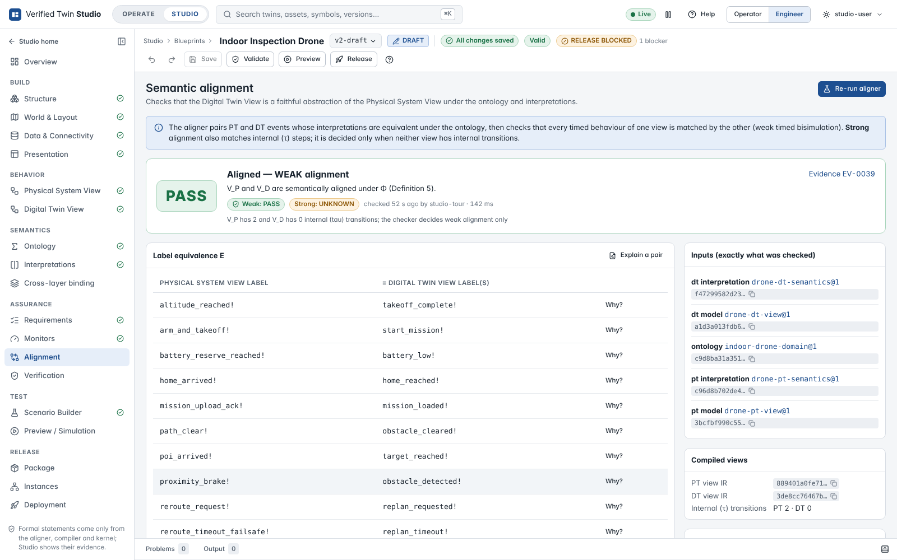

## Assurance → Verification

Every check behind the version, grouped by what it establishes — **formal verification**
(artefact validation, alignment, compilation with translation validation), **structural
validation**, **tests** (scenario regression — tests, not proofs) and **release integrity** — each
with its evidence and a **Run** button. **Run all checks** validates the artefacts, compiles,
aligns and runs the scenarios in that order; the headline says **VERIFIED** only when every
formal check passes for these inputs. The evidence history lists the evidence recorded for the
pinned Digital Twin View.

Continue with [scenarios and preview](scenarios-and-preview.md).
