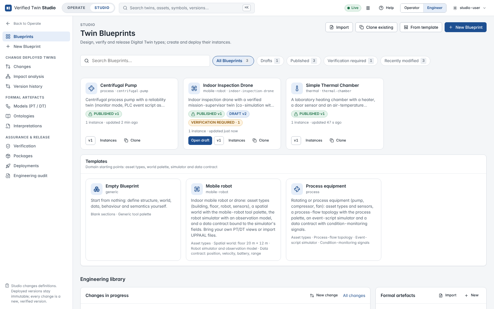
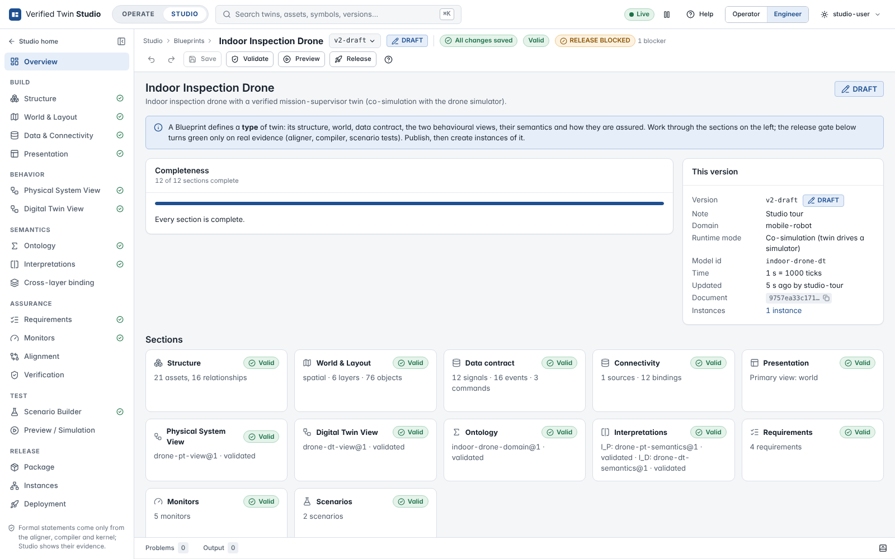

# Twin Blueprints

A **Twin Blueprint** is the reusable engineering definition of a *type* of digital twin: what it
consists of, where things are, which data it receives, how the physical system and the twin
behave, what that behaviour means, how it is assured and how operators see it. A **twin
instance** is one concrete twin created from a published Blueprint version — Pump P-101,
Drone-01, Chamber TC-1 — with its own assets, identity, data sources and deployment.

Studio is where Blueprints are designed, verified and released (**STUDIO** mode). Operate is
where their instances run and are monitored (**OPERATE** mode). Every instance page in Operate
has an **Open in Studio** action that leads to the exact Blueprint version the instance runs.

## Versions

| State | Meaning |
|---|---|
| **DRAFT** | Editable. Every edit is saved automatically into the draft; each save is checked against the revision it was based on, so two editors never overwrite each other silently. A Blueprint has at most one draft. |
| **PUBLISHED** | Immutable. Instances are created from published versions only. To change a published version, *Create draft from this version*; the new draft starts as an exact copy. |

## One Blueprint, separate models

The layers of a twin are kept apart on purpose, each with its own editor and its own format.
Only the formal layers are covered by formal verification; the others are versioned and
integrity-protected.

| Section | Holds | Assurance |
|---|---|---|
| **Structure** | Asset types (with property schemas), the assets every instance gets (*instance* scope) or shares (*context* scope: the lab, the site), their hierarchy and relationships | validated, integrity-protected |
| **World & Layout** | `twin-world/1`: a spatial map (millimetres), a topology or a diagram; layers by role — shared, **ground truth**, **twin knowledge**, events, annotations, background images | validated, integrity-protected |
| **Data & Connectivity** | The data contract (static properties, telemetry signals with their ontology symbol, events with their formal labels, commands) and the sources and bindings that deliver it (MQTT, OPC UA, REST, simulator, replay, file) | validated, integrity-protected |
| **Presentation** | How Operate shows the twin: state labels and tones, key signals, charts | no formal effect |
| **Behavior** | The **Physical System View** V_P and the **Digital Twin View** V_D as timed automata (canonical `twin-ta/1`; UPPAAL import) | **formally verified** |
| **Semantics** | The **ontology** K and the **interpretations** I_P and I_D (meaning of every state and event) | **formally verified** |
| **Assurance** | Requirements, monitors (`twin-monitors/1`) and the alert policy | validated against the views; packaged with the verified core |
| **Scenarios / simulation** | Executable test scenarios; simulator inputs | **tests, not proofs** |

## Verified Core Package and Deployment Bundle

Releasing a version produces two artefacts, shown side by side in **Release → Package**:

- the **Verified Core Package** — the pinned PT/DT views, ontology and interpretations, the
  compiled Twin IR (translation-validated), the alignment and compilation evidence and the
  monitor definitions. This is what the formal evidence covers.
- the **Deployment Bundle** — the Blueprint document (structure, world, data contract,
  connectivity, presentation, scenarios) and the generated simulator inputs. Versioned and
  hash-protected, **not** formally verified.

## Precise status words

Studio never paints a state green by default, and each word means one thing:

| Word | Means |
|---|---|
| **VALID** | An artefact passed its validator (strict parser, aligner parser, Z3 consistency). |
| **VERIFIED** | Every formal check passes for exactly the pinned inputs: the five artefacts are VALID, the views are semantically aligned, and the DT view compiled with translation validation. |
| **PASS / FAIL / UNKNOWN / ERROR** | A checker's verdict. ERROR means the check could not decide (never a negative verdict). Alignment is reported as **strong** or **weak**; strong alignment is UNKNOWN when either view has internal (τ) transitions. |
| **READY TO RELEASE / RELEASE BLOCKED** | The release gate of a version, computed from evidence for exactly its inputs. |
| **VERIFICATION REQUIRED** | (Library) a draft whose release gate does not pass yet. |
| **DEPLOYED** | The deployment supervisor runs the instance's runtime. |
| **CONFORMANT** | The running twin's runtime admits every observed event (conformance monitoring). |
| **STUDIO PREVIEW** | An isolated run of a version in Studio: no twin record, no deployment, no stored telemetry. |
| **SATISFIED / VIOLATED / FINDING / UNKNOWN** | A monitor's live result, evaluated by its authority (runtime, property evaluator, telemetry store). |

## The Studio home

**Studio → Blueprints** lists every Blueprint with its published version, its draft, the draft's
release gate and its instances. The shelves filter **All**, **Drafts**, **Published**,
**Verification required** and **Recently modified**; search matches names, ids, domains and
descriptions. From here: **New Blueprint**, **From template**, **Clone existing**, **Import**.

The installed **templates** are domain starting points (asset types, a world with its tool
palette, a simulator and a data contract): *Empty Blueprint*, *Mobile robot* (indoor robots and
drones) and *Process equipment* (pumps, compressors, fans).

Below the Blueprints, the **engineering library** keeps the shared formal artefacts (models,
ontologies, interpretations), changes to deployed twins, evidence, packages and the engineering
audit.

## Five ways to create a twin

**Your twins → + Create / Import Twin** offers:

1. **New Blueprint** — design a new type of twin with the guided wizard.
2. **From a template** — start from a domain template.
3. **Instantiate an existing Blueprint** — create another concrete twin from a published version.
4. **Import a twin** — a `twin-blueprint-bundle/1` file exported from another Studio
   (**Release → Package → Export**).
5. **Import formal models** — an existing verified twin: UPPAAL PT and DT views, the ontology and
   both interpretations become a new Blueprint. Models are converted to the canonical form on
   the server; a construct outside the supported fragment is listed and the role left empty —
   never approximated.

## The New Blueprint wizard

The wizard has eleven steps. Steps 1 and 2 are the **New Blueprint** page; **Create** makes the
first draft on the server. Steps 3–11 walk through the real editors with a step bar — **Back**,
**Skip**, **Next**, **Save and exit** (everything is already saved; reopen the draft any time)
and **Jump to advanced** (leave the guided flow; every field shown).

| Step | Where | What |
|---|---|---|
| 1 Starting point | New Blueprint | Blank, template, clone, bundle import or formal models |
| 2 Identity | New Blueprint | Name, id, domain, icon, description, runtime mode (monitoring or co-simulation), time unit and resolution |
| 3 Structure | Build → Structure | Asset types and assets |
| 4 World & layout | Build → World & Layout | Map, topology or diagram (skip for twins without a layout) |
| 5 Data & connectivity | Build → Data & Connectivity | Signals, events, commands; sources and bindings |
| 6 Physical System View | Behavior → PT | The real system's timed behaviour |
| 7 Digital Twin View | Behavior → DT | The twin's abstraction of it |
| 8 Semantics | Semantics | Ontology, then interpretations |
| 9 Requirements & monitors | Assurance | What must hold, and what checks it at run time |
| 10 Scenarios | Test → Scenario Builder | Timed test cases |
| 11 Verify & release | Assurance → Verification, Release | Run all checks, package, publish |

**Guided** and **expert** modes (workspace options, `?` in the top bar) change how much is
shown: guided mode explains each page and hides advanced fields; expert mode shows every field
and the JSON view of each section.

## The Blueprint overview

Each version opens on its overview: completeness of every section, the next steps, the
release gate with the evidence behind each item, the pinned formal artefacts and the trust
boundary (what is formally verified and what is only integrity-protected).

## Search and commands

**⌘K** (or `/`) opens the command palette. Without a query it offers commands — *New
Blueprint*, *Import a twin*, *Instantiate a published Blueprint* and, inside a Blueprint, *Go to*
every section of the open version. With a query it searches Blueprints and their elements (asset
types, assets, world objects, signals, events, commands, sources, requirements, monitors,
scenarios and model states) together with twins, assets, artefact versions, ontology symbols,
evidence, packages and changes, ranked by the backend.

## Examples

| Blueprint | Shows |
|---|---|
| **Indoor Inspection Drone** | Co-simulation with the mobile-robot simulator: a spatial world whose ground truth differs from the twin's knowledge, replanning within a deadline, the mission map plugin |
| **Centrifugal Pump** | Monitoring of a PLC event log: a process topology, condition-monitoring signals, PT events translated through the alignment |
| **Simple Thermal Chamber** | The [Build Your First Twin](tutorial-first-twin.md) tutorial, built from scratch |

Continue with [the Blueprint workspace](blueprint-workspace.md).
