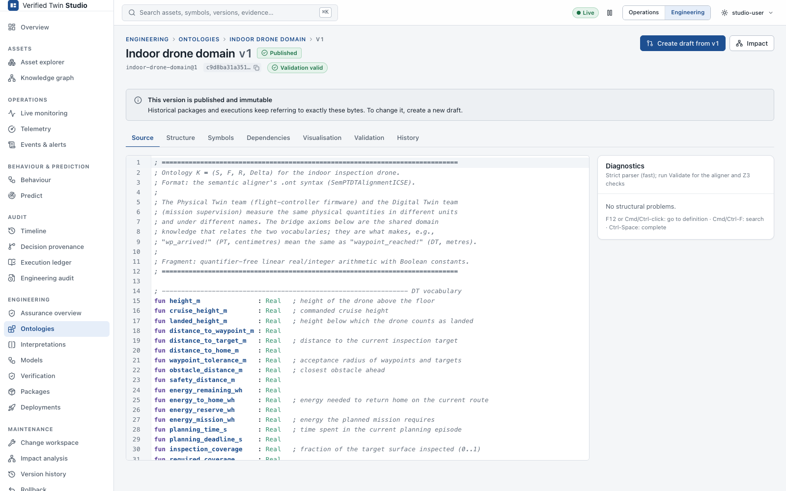

# Ontology management

## Formal ontology vs. asset knowledge graph

| | Formal ontology | Asset knowledge graph |
|---|---|---|
| Is | A first-order theory Φ = (signature, axioms Δ) | Asset **instances** and operational relationships |
| Used by | Interpretations, semantic alignment, refinement | Navigation, context, operations |
| Format | `.ont` (SemPTDTAlignmentICSE) | Studio assets and relationships |
| Versioned | Yes: immutable published versions, evidence | No: operational metadata |
| Example | `axiom temp_limit_val : (= bearing_temp_limit 90)` | `Pump P-101 —contains→ Bearing B4` |

The two can refer to each other: a telemetry channel names the ontology symbol it observes.
They remain distinct artefacts. Editing the asset graph never changes the meaning of anything.

## What an ontology contains

Studio edits exactly the language that SemPTDTAlignmentICSE reads:

```
sort Temperature                                  ; a sort (the aligner maps sorts to Real)
fun  bearing_temp       : Temperature             ; a constant (0-ary function)
fun  distance           : Point Point -> Real     ; a function with arguments
rel  motor_running      :                         ; a relation (proposition) with its argument sorts
axiom temp_limit_val    : (= bearing_temp_limit 90)   ; an axiom: SMT-LIB formula, QF_LRA fragment
```

An interpretation maps each **location** and each **event label** of a behaviour model to a
formula over the ontology's symbols:

```
NORMAL              : (and motor_running (<= bearing_temp bearing_temp_limit) (<= vibration_rms vibration_limit))
condition_degraded! : (or (> bearing_temp bearing_temp_limit) (> vibration_rms vibration_limit))
```

Entries that are not listed are internal (τ) for alignment purposes.

## Browsing

Under **Engineering → Ontologies**, open an ontology, then a version. The version page has
these tabs:

| Tab | Shows |
|---|---|
| Source / Editor | The authoritative text, with highlighting and diagnostics |
| Structure | Sorts, functions, relations and axioms as tables, filterable, with *Go to definition* |
| Symbols | One symbol: declaration, axioms that constrain it, interpretation entries that use it, the telemetry channels that observe it |
| Dependencies | Interpretations over this ontology and where it is deployed |
| Visualisation | A graph of symbols and the axioms connecting them (a view, never the source of truth) |
| Validation | The latest validation evidence |
| History | Lineage of versions and the engineering events for this artefact |

Interpretation versions have an **Evaluate** tab instead of Visualisation. It evaluates every
entry against current or hand-entered observations; the backend does the evaluation with Z3.



## Versioning and lifecycle

Every version records:
- the artefact id and version number
- the parent version
- a SHA-256 of its content
- creation and publication time and actor
- a change description
- its lifecycle state:

| State | Meaning | Editable |
|---|---|---|
| **DRAFT** | Work in progress | yes |
| **VALIDATING** | A validation run is in progress | no |
| **VERIFIED** | The last validation passed for exactly this content | edits return it to DRAFT |
| **PUBLISHED** | Released. Immutable forever. | never |
| **SUPERSEDED** | A newer version was published | never |
| **REJECTED** | Abandoned, with a reason. Kept for the record. | never |

Rules:
- A published version is never edited. **Create draft from vN** makes a new version with vN
  as its parent.
- There is at most one open draft per artefact.
- Packages and executions keep pointing at the exact versions they used.

## Save, Validate, Check refinement, Analyze impact, Publish

These are separate actions, and each one does only what it says:

| Action | Does | Does **not** |
|---|---|---|
| **Save draft** | Stores the text and runs the strict parser (fast diagnostics) | Validate, publish, deploy, assert refinement or alignment, touch history |
| **Validate** | Runs the strict parser, SemPTDTAlignmentICSE's parser (cross-checked) and Z3 consistency; stores validation evidence; moves the draft to VERIFIED or back to DRAFT | Publish |
| **Compare** | Opens the semantic and source diff against the parent | — |
| **Check refinement** | Runs Def. 4 against a base version; stores evidence ([Refinement](refinement.md)) | Change lifecycle state |
| **Analyze impact** | Computes what depends on the deployed version ([Impact](impact-and-staleness.md)) | — |
| **Publish** | Makes a VERIFIED version immutable | Deploy (that is a separate, explicit step) |

**Publish** is disabled until the version is VERIFIED. The server enforces this independently
and answers *409 — Not allowed in the current lifecycle state* otherwise. Inside a change
workspace, publishing happens at **Release**.

## The editor

The editor offers:
- syntax highlighting for `.ont`, `.interp` and UPPAAL XML
- **diagnostics at their location**, with code, message and severity
- autocompletion of declared symbols (Ctrl-Space)
- **go to definition** (F12 or ⌘/Ctrl-click) and cross-references through the Symbols tab
- search (⌘/Ctrl-F) and undo/redo

Live updates never overwrite a draft you are editing. Leaving with unsaved changes asks for
confirmation.

### Diagnostics

| Code | Severity | Meaning |
|---|---|---|
| ONT001 | error | Unknown keyword: the aligner would silently skip this line |
| ONT002 | error | `fun`/`rel`/`axiom` declaration is missing `:` |
| ONT003 | error | `sort` without a name |
| ONT004 | error | Duplicate declaration |
| ONT005 | warning | Symbol used as a sort but not declared (the aligner reads it as Real) |
| ONT006 | error | Malformed axiom formula |
| ONT007 | error | Axiom uses an undeclared symbol |
| ONT008 | error | Duplicate axiom id |
| ONT009 | error | Invalid sort name |
| ONT010 | warning | Declaring a built-in sort has no effect |
| ONT100 | error | SemPTDTAlignmentICSE could not load the theory |
| ONT101 | error | The aligner reads a different signature than the strict parser |
| ONT110 | error | The axioms are inconsistent (an inconsistent ontology entails everything) |
| ONT111 | warning | Z3 could not decide consistency |
| INT001 | error | Line is not `Location : formula` or `label! : formula` (the aligner would skip it) |
| INT002 | error | Duplicate entry (the aligner keeps only the last one) |
| INT003 | error | Malformed formula |
| INT004 | error | Entry uses a symbol the ontology does not declare |
| INT005 | error | Invalid location or label name |
| INT100 | error | The underlying ontology is not valid |
| INT110 | warning | The entry is unsatisfiable under the axioms: it can never hold |
| INT111 | warning | The entry is valid under the axioms: it always holds |

Why two parsers? The aligner silently skips text it does not understand; see
[aligner findings](aligner-findings.md) S1. Studio's strict parser makes every such line an
error, and validation cross-checks that both parsers see the same theory.

## Ontology diff

**Compare**, or **Maintenance → Version history**, shows two diffs:
- **Semantic / structural diff**: symbols, relations and functions added, removed or changed,
  and axioms added, removed or modified. Comments and whitespace are ignored. It also lists
  *symbols whose meaning may change* and the **interpretation entries that depend on them**.
- **Source diff**: side by side, line by line.

The structural diff tells you *what changed*. Whether that change is safe is decided only by
the [refinement check](refinement.md), never by the size of the diff.

## Interpretation editing

Interpretations are versioned artefacts with the same lifecycle, editor, diagnostics, diff and
history as ontologies. An interpretation is validated against a specific ontology version.
Changing an interpretation can change the meaning of observations, so it requires the same
evidence:
- refinement condition (c) when used with a refined ontology
- otherwise realignment

Impact analysis shows what it affects.
