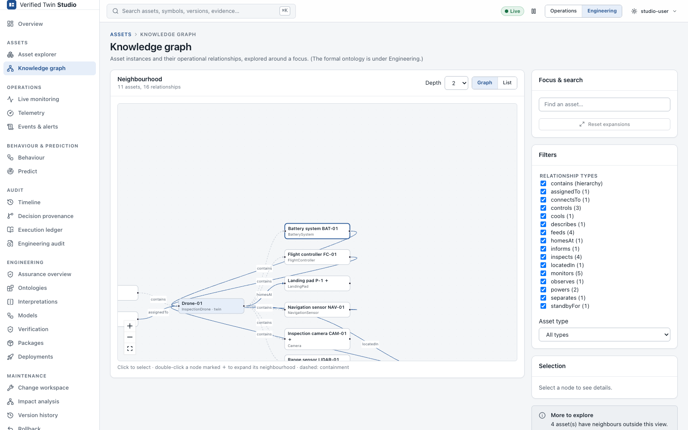
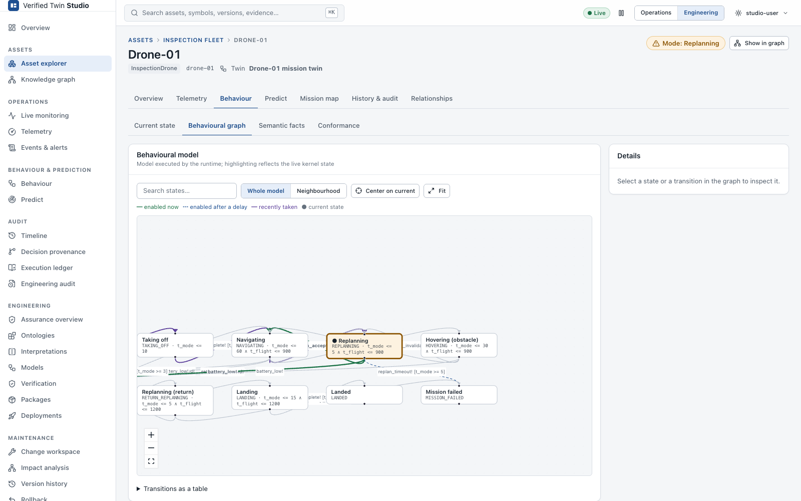
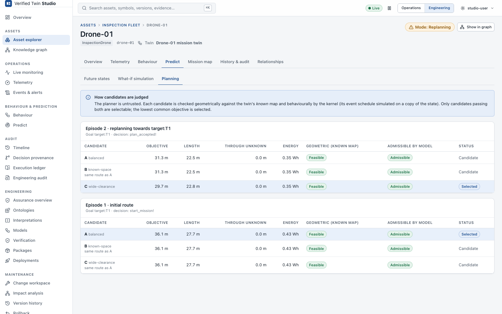
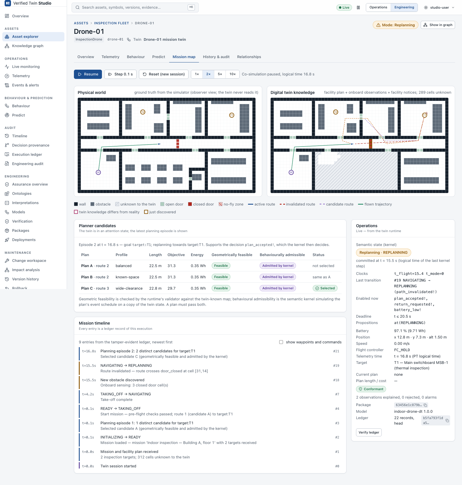
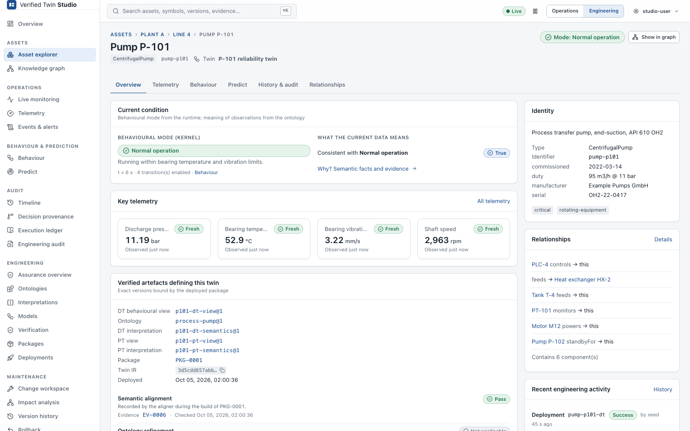

# Operations

The operations views follow the chain **asset → telemetry → meaning → verified behaviour →
prediction → decision**. Every view is generic and works for any twin. The screenshots show
both examples.

## Assets and the knowledge graph

**Assets → Asset explorer** shows the asset hierarchy on the left and a sortable, filterable
table of all assets on the right:
- identifier, type and tags
- the digital twin bound to the asset, if any

The **asset page** answers the operator's first questions at a glance:
- what the asset is
- whether it is healthy
- what it is doing (the kernel's mode)
- whether anything is wrong (alerts, conformance)
- what will probably matter next

It also names the verified artefacts that define the twin: model, ontology, interpretation and
package, each with its version.

**Assets → Knowledge graph** explores asset *instances* and their operational relationships
(`contains`, `feeds`, `powers`, `monitors`, `controls`, `locatedIn`, `observedBy`, ...). It
always works around a focus:
- **Depth** sets how many hops from the focus are shown.
- Nodes marked **＋** have more neighbours; double-click to expand them.
- Filters select relationship and asset types.
- **List** gives an accessible, searchable alternative to the canvas.
- Clicking a node selects it; the details panel then links into the asset.

Large estates are never drawn as a whole.



> The asset knowledge graph is **not** the formal ontology. See
> [Ontology management](ontology-management.md#formal-ontology-vs-asset-knowledge-graph).

## Telemetry and what it means

**Telemetry** (on the asset or under Operations) is schema-driven:
- **Value types**: numeric, boolean, categorical and string channels.
- **Display**: units, quality flags (good / uncertain / bad) and freshness (fresh, stale,
  missing).
- **Time ranges**: Live, 15 min, 1 h, 6 h, 24 h, 7 d or a custom range.
- **Navigation**: zoom, hover inspection and a legend.
- **Export**: CSV or JSON with observation time, ingestion time and quality.

Gaps stay gaps: Studio never interpolates across missing data. Series with different units
are drawn on separate axes. Dense history is downsampled by the server, which reports that it
did.

The **meaning** of telemetry comes from the twin's interpretation. Each location and event
label is a formula over ontology symbols. **Why?** shows the evidence chain, for example:

```
observations  bearing_temp = 94.1 degC, vibration_rms = 3.2 mm/s
              (source runtime:pump-p101-dt/telemetry#…, observation time, 2 s old)
     ↓  interpretation p101-dt-semantics@1:
          condition_degraded! : (or (> bearing_temp bearing_temp_limit) (> vibration_rms vibration_limit))
     ↓  ontology process-pump@1:  axiom temp_limit_val : (= bearing_temp_limit 90)
TRUE  (evaluated by Z3 against the ontology's axioms)
     ↓  kernel: transition condition_degraded!  NORMAL → DEGRADED (ledger record #n)
```

A proposition can be **True**, **False**, **Unknown** or **Inconsistent observation**:
- *Unknown* means an observation is missing or stale, or Z3 could not decide.
- *Inconsistent observation* means the observed values contradict the ontology's axioms.

## Behaviour

**Behaviour → Current state** is the kernel's committed state:
- the mode, since when it has held, and the logical time
- the deadline before the state must be left
- clocks and active propositions
- **available next actions**: transitions the kernel reports as admissible, with their time
  windows
- **unavailable** actions

Every item links to its definition.

**Behaviour → Behavioural graph** draws the DT model:
- current state, enabled transitions (now / after a delay) and recently taken transitions
- states and transitions open a detail panel: event, guard, clock resets, interpretation and
  last execution time
- large models open centred on the current state; **Fit** shows everything, and
  **Neighbourhood** limits the view to the current region
- search and a list view are available



## Conformance

**Behaviour → Conformance** reports the kernel's judgement of every observation and decision:

| Status | Meaning |
|---|---|
| **Conformant** | Every observation was admitted by the model. |
| **Deviation detected** | The first divergence is shown with its time, the observed event, what the model permitted, the model state, the execution and the ledger record. |
| **Unknown / insufficient data** | No observations yet, or none judged. |

Problems are classified, so a missing observation is never reported as a violation:
**Model violation**, **Refused input**, **Monitoring alarm**, **Malformed observation time**,
**Ambiguous state** (nondeterminism) and **Infrastructure error**.

## Events and alerts

**Operations → Events & alerts** is one timeline for:
- semantic transitions, refusals and alarms
- planner decisions and world updates
- runtime errors and deployment changes

Filters cover severity, asset, type, time and free text. Consecutive identical events are
grouped (×N). Each event links to its ledger record and to *Why?*.

## Prediction, what-if and planning

These are under **Predict** on an asset, or at the top level.

- **Future states**: the kernel explores the model from a copy of the current state, within the
  depth / horizon / node limits you set. Every branch is **admissible by model**. The tree shows
  the time window of each step. Nothing is called "safe" unless the model provides that basis.
- **What-if simulation** works on a forked copy of the twin, under a **SIMULATION** banner. You
  can:
  - inject events and advance logical time
  - name and fork scenarios
  - compare with live and reset

  The kernel answers every step: an admitted step shows the new state; a refused step shows
  the kernel's reason. No behaviour is simulated in the browser.
- **Planning** shows a planner's candidates as reported by the runtime: objective/cost and
  status (**candidate**, **selected**, **rejected**, or **prohibited by model** with the
  kernel's reason). A plan can be a route, a control sequence, a maintenance sequence or a
  schedule. Domain plugins may render it richer; the drone draws routes on its map.



## Domain views

When a plugin applies to a twin, its asset page gets an extra tab, which is also reachable
from **Digital twins** in the navigation. The drone's tab shows the physical world, the
twin-known world, the drone, the executed path, current and invalidated plans, discovered
obstacles and targets. Without a plugin, every generic view still works. The pump has no
plugin.



