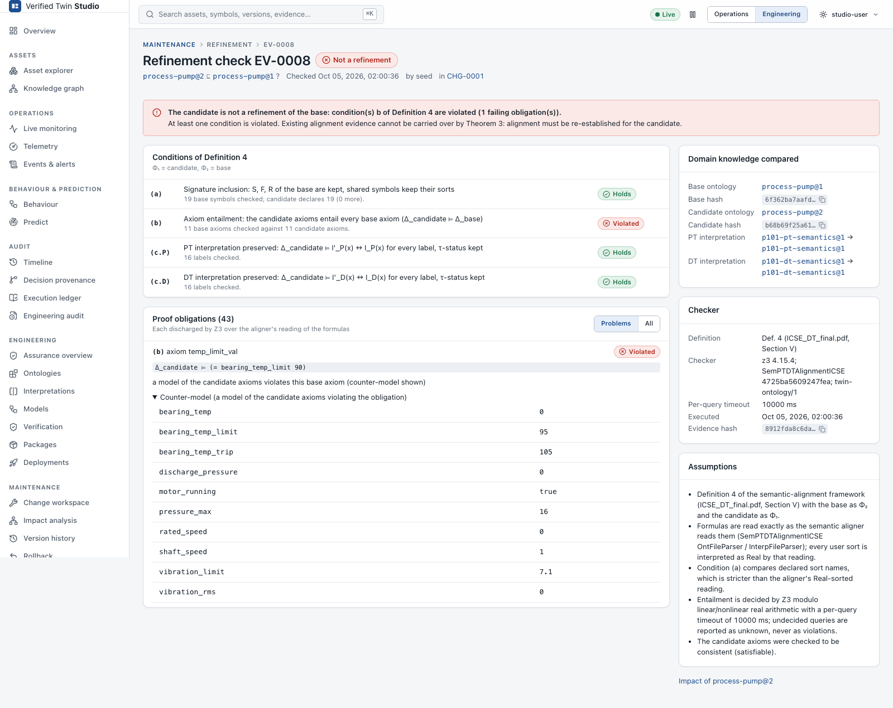

# Refinement checking

## The definition Studio checks

Studio implements **Definition 4** of the formal theory behind SemPTDTAlignmentICSE. Let
Φ = (signature, Δ, I_P, I_D) be the domain knowledge: ontology plus PT and DT interpretations.
Then Φ₁ ⊑ Φ₂ (Φ₁ *refines* Φ₂) holds when all of these hold:

| Condition | Statement | How it is checked |
|---|---|---|
| **(a)** signature | Every sort, function and relation of Φ₂ exists in Φ₁ with the same sorts | Structurally, on the declared sort names. This is stricter than the aligner, which maps all sorts to Real ([finding S4](aligner-findings.md)). |
| **(b)** axioms | Δ₁ ⊨ Δ₂: the new axioms entail every old axiom | One Z3 query per old axiom: is Δ₁ ∧ ¬δ satisfiable? |
| **(c)** interpretations | Δ₁ ⊨ I₁,X(x) ↔ I₂,X(x) for every location/label x of the PT (X = P) and DT (X = D), and an entry's τ-status is unchanged | One Z3 query per interpretation entry |

Each query is an **obligation**. It is *discharged* (Z3: unsat), *violated* (Z3: sat, with a
counter-model) or *undecided* (Z3: unknown or timeout). Studio runs its own three-valued
queries because the aligner's `Ontology::entails` reports "unknown" as "false"
([finding S3](aligner-findings.md)).

Refinement is **not** text inclusion. A pure addition, such as a new symbol or a new axiom,
usually refines; a changed constant usually does not. The checker decides; the size of the
diff does not.

## Running a check

On a version page, **Check refinement** asks for:
- **Base ontology (K₂)**: the version to be refined, by default the parent (the deployed one).
- **Twin context**: whose deployed PT/DT interpretations to include for condition (c). By
  default this is the first twin that uses the base. Without a context, (c) is reported as
  *not evaluated*.

**Run refinement check** calls `POST /api/v1/refinement-checks`. The check runs in the backend
with a per-query timeout, and the result is stored as evidence.

## Understanding the four results

| Result | Meaning | What to do |
|---|---|---|
| **VALID REFINEMENT** | Every condition holds; every obligation was discharged | Alignment may be carried over by Theorem 3 (see below) |
| **NOT A REFINEMENT** | At least one obligation is **violated**. The report names the condition, the axiom or entry, and a **counter-model** | Realign, or change the draft |
| **UNKNOWN / INCONCLUSIVE** | Nothing was violated, but at least one obligation is **undecided** | Treat as not established. Simplify the axioms or raise the timeout and re-run. |
| **CHECK FAILED** | The check could not be carried out: invalid or inconsistent input, or the checker failed | Fix the input (validate first) and re-run. This is **not** a verdict about refinement. |

These results are never merged. In particular, an infrastructure error or invalid input is
never shown as NOT A REFINEMENT, and an inconsistent candidate (which would entail
everything) is CHECK FAILED, not vacuously VALID ([finding S5](aligner-findings.md)).

## The report

The refinement page (`/maintenance/refinement/EV-…`) shows:
- **the verdict and a summary**, with the conditions (a), (b), (c.P), (c.D) and each one's status
- **the obligations**: condition, subject (axiom or entry), the statement checked, its status,
  and the counter-model for violated ones
- **the failure reasons**, for CHECK FAILED
- **the assumptions** under which the result holds, for example the QF_LRA fragment, sort
  names compared structurally, and the per-query timeout
- **the identity**: base and candidate versions, their content hashes, checker identity (Z3
  version, SemPTDTAlignmentICSE commit, `twin-ontology` format) and timestamp
- **links**: to impact analysis for the candidate and to the change workspace

## Refinement evidence

Every run is stored and never overwritten. Each record holds:
- the base and candidate ontology and interpretation **versions and hashes**
- the checker identity
- the formal result, assumptions and diagnostics
- the creation time and actor
- the **evidence hash**: the SHA-256 of the stored document, re-verified when read

Evidence is linked from:
- the version's History and the Verification list
- the change workspace pipeline, impact analysis and packages
- the engineering audit

Evidence also has an **applicability** that is computed whenever it is read. See
[staleness](impact-and-staleness.md#verification-staleness).

## Alignment preserved by refinement (Theorem 3)

> **Theorem 3.** If Φ′ ⊑ Φ and V_P ∼_Φ V_D, then V_P ∼_Φ′ V_D.

Studio concludes **ALIGNMENT PRESERVED BY REFINEMENT** only when **all** premises hold for the
exact artefacts:
1. There is passing alignment evidence V_P ∼_Φ V_D for the deployed Φ and the twin's models.
2. There is a **VALID REFINEMENT** result Φ′ ⊑ Φ for exactly these base and candidate hashes,
   interpretations included (condition (c) evaluated).
3. The PT and DT models are unchanged.

If any premise is missing, failed, undecided or stale, the result is **REALIGNMENT REQUIRED**,
and the pipeline's alignment stage re-runs SemPTDTAlignmentICSE. Studio never infers
preservation from a small diff, matching symbol names, successful parsing, or a refinement
check without interpretations.

Most `_v2` evolutions shipped with the aligner's case studies are **not** refinements under
Def. 4 ([finding S2](aligner-findings.md)). For those, Studio requires realignment, as the
theory demands.
