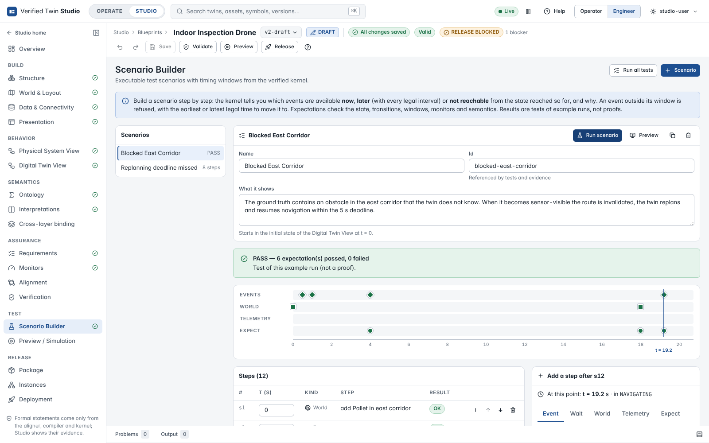
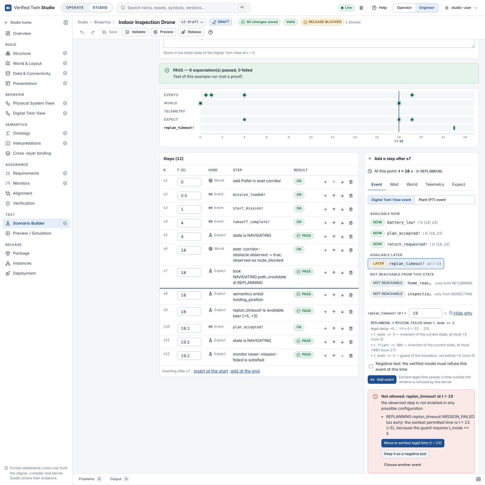
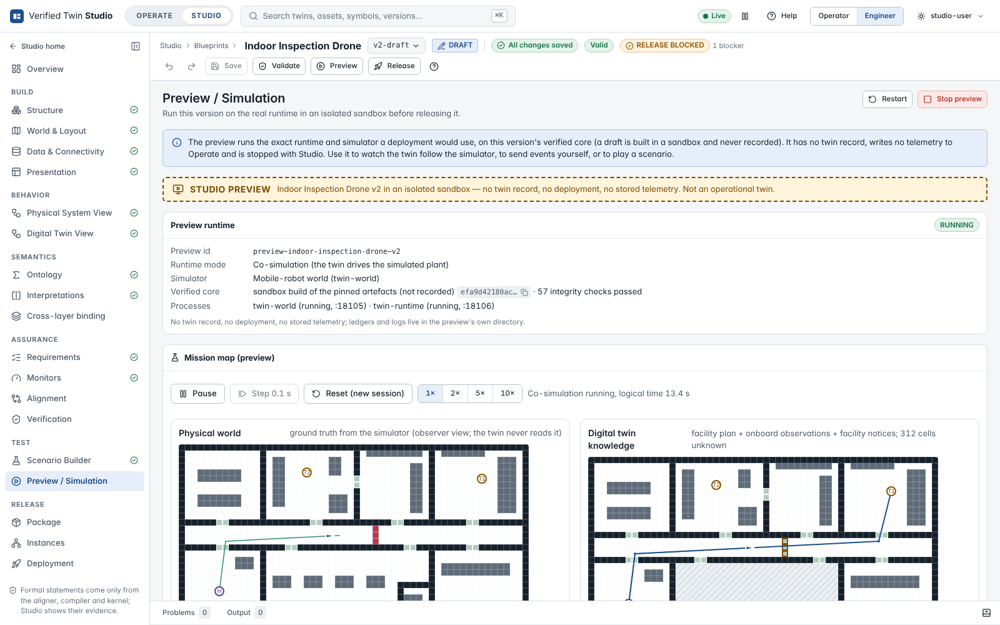

# Scenarios and preview

## Test → Scenario Builder

A scenario is an executable test case of the twin, starting in the initial state of the Digital
Twin View at t = 0. Its steps, in order:

| Step | Does |
|---|---|
| **Event** | A Digital Twin View event (`start_heating!`) or a plant event (`heater_on!`, translated to its DT counterpart through the alignment's label equivalence) at a logical time. Mark it **negative test** when the verified model must refuse it. |
| **Wait** | Lets logical time pass. |
| **World** | Changes the environment (ground truth): add, remove or move an object, change a property. The twin learns it only through an **observation**: choose the data-contract event the change produces. |
| **Telemetry** | Signal values at a time (context for expectations and monitors). |
| **Expect** | The twin is in a state; the last event took a transition; an event is available now / later / not reachable (with its window); a property monitor is satisfied or violated; the state entails a semantic formula (Z3 over the ontology); the world has a property. An expectation at a later time lets time pass first. |

### Timing windows come from the kernel

At the insertion point (the end of the scenario, or after any step: **+**), the **Add a step**
panel shows the state reached so far and every event of the Digital Twin View by availability,
as computed by the semantic kernel on the compiled view:

- **AVAILABLE NOW** — enabled at the current time, with every legal interval;
- **AVAILABLE LATER** — enabled after a delay, with every legal interval (an event's legal
  delays can be non-convex: several intervals);
- **NOT REACHABLE** — never by waiting from here (*blocked*), or only from other states.

Selecting an event draws its window on the timeline and presets its **earliest legal time**.
**Why this window?** explains each bound by the atom that sets it: the invariant of the current
state, the guard of the transition, the invariant of the target state after resets.

### Illegal steps

Adding an event at a time the model forbids is refused by the kernel, with its reason (*too
early: the earliest permitted time is t = 23 (+5), because the guard requires t_mode >= 5*) and
the legal times it reported:

- **Move to earliest legal time** / **Move to latest legal time**;
- **Keep it as a negative test** (the step must be refused when the scenario runs);
- **Choose another event**.

A step that becomes illegal after an earlier edit is marked **ILLEGAL** in the list; **Why?**
gives the same reasons and fixes. Studio computes no timing itself.

### Running scenarios

**Run scenario** runs one scenario on the kernel and marks every step PASS, FAIL, OK, REFUSED or
NOT EVALUATED, with the expected and actual values of a failed expectation. **Run all tests**
runs every scenario and records **scenario evidence** for exactly the version's inputs — part of
the release gate. Scenario results are tests of example runs, **not proofs**.

## Test → Preview / Simulation

**Start preview** runs the version for real — the runtime on its verified core (the version's
package, or for a draft a sandbox build of the pinned artefacts that is never recorded) with its
simulator — under a **STUDIO PREVIEW** banner:

- no twin record, no deployment, no stored telemetry; ledgers and logs live in the preview's own
  directory, and the preview is stopped with Studio;
- the kernel's live state (state, logical time, deadline, conformance, possible next events with
  their windows) and an event log;
- **Drive the preview**: send a plant or twin event at a time, or **play a scenario's** events
  (start the preview without its event-script simulator so nothing else drives it);
- the Blueprint's domain view when it names one — the drone's mission map, with the physical
  world (ground truth) next to the twin's knowledge, routes and replanning.

Continue with [release, instances and deployment](blueprint-release.md).
