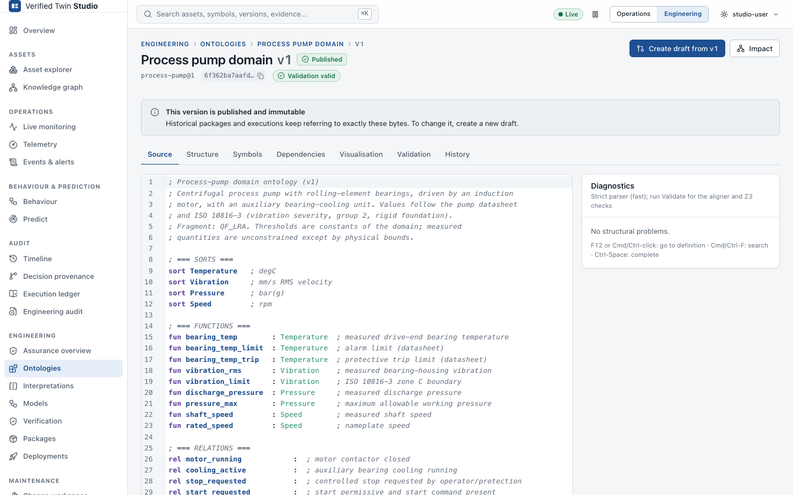
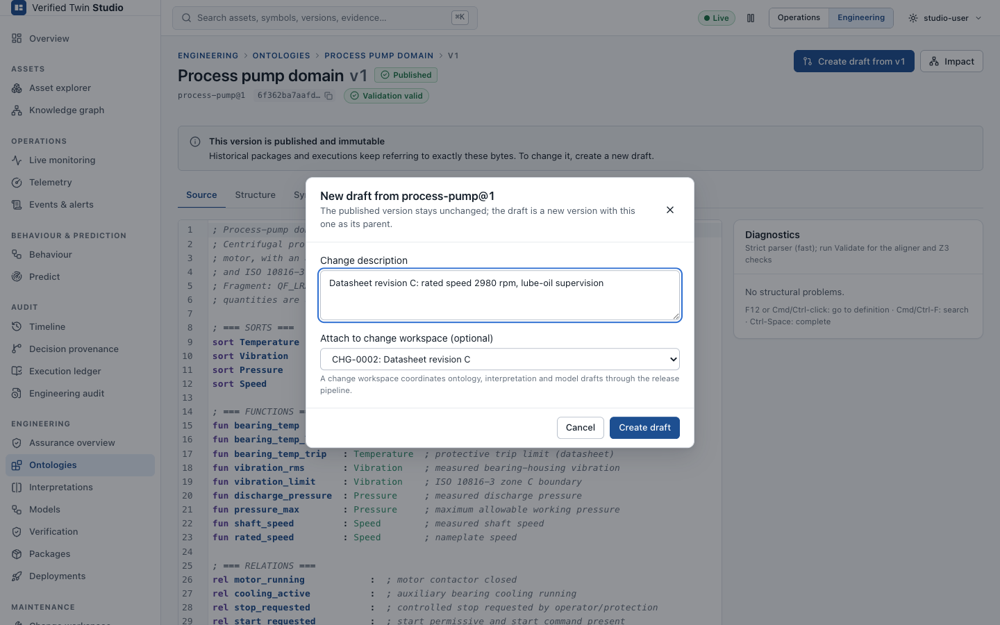
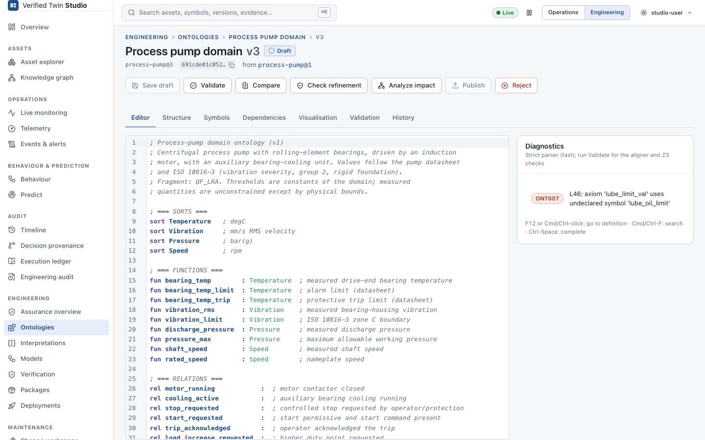
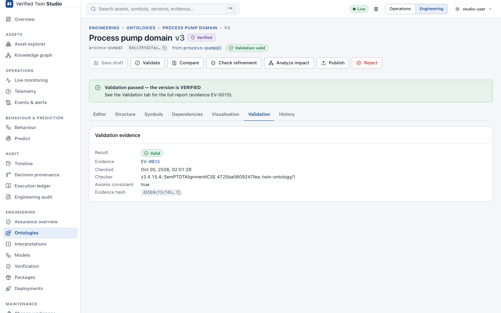
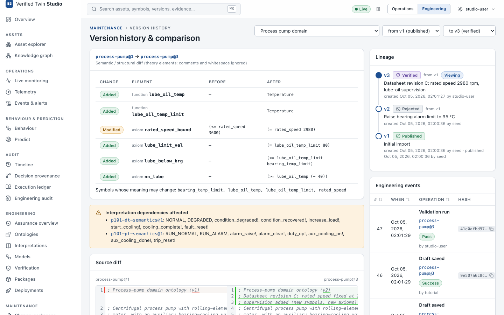
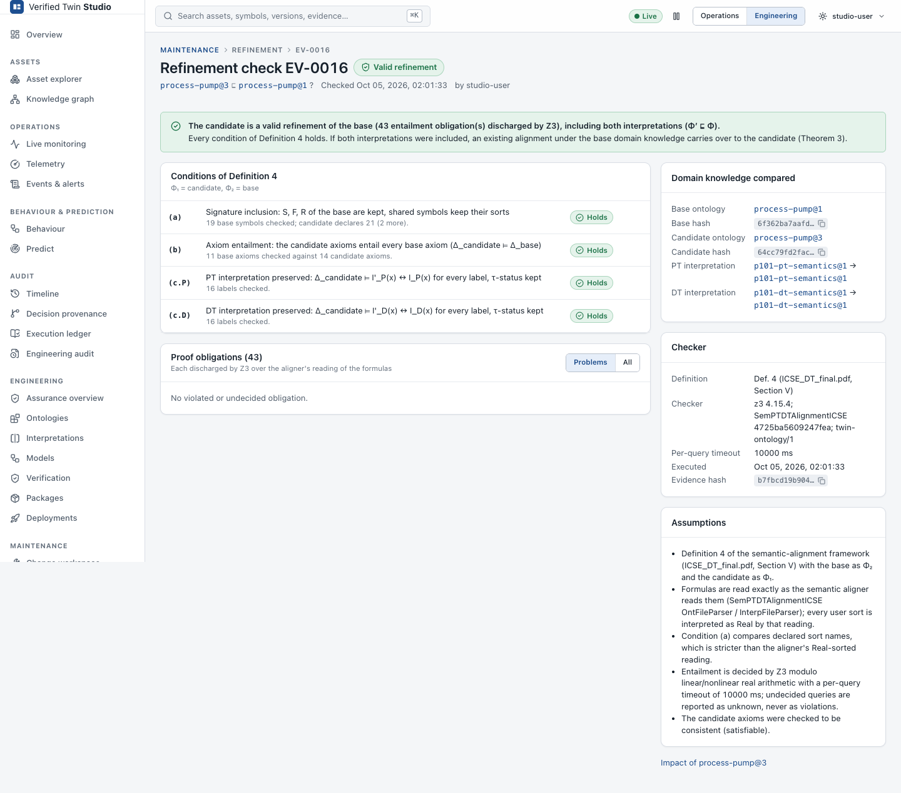
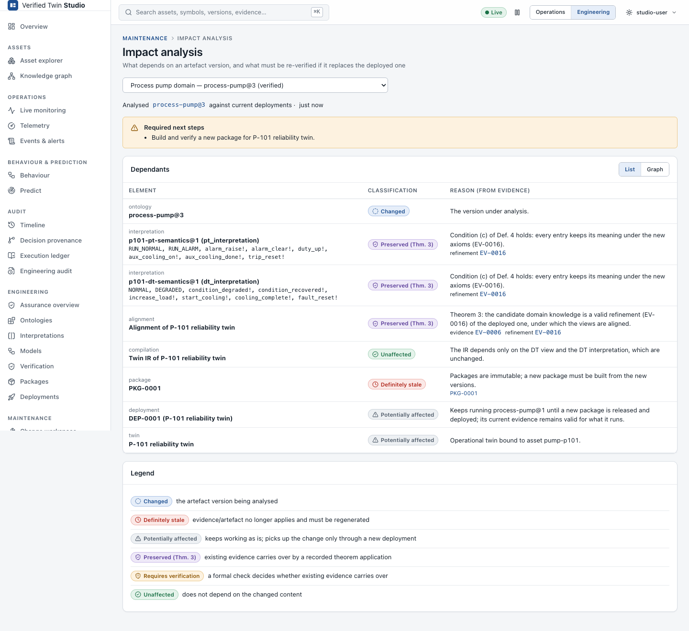
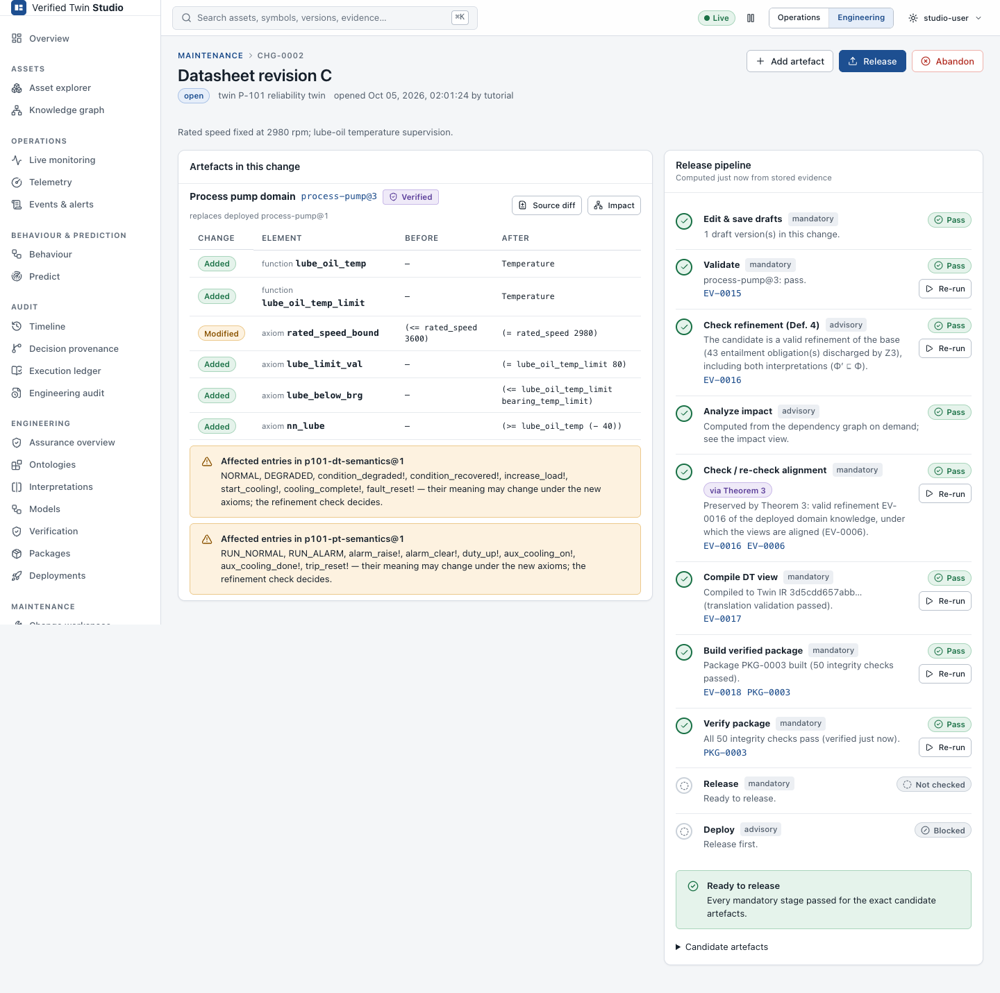
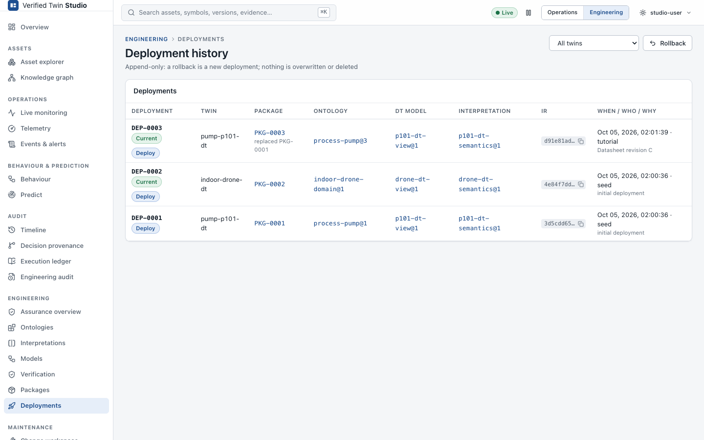
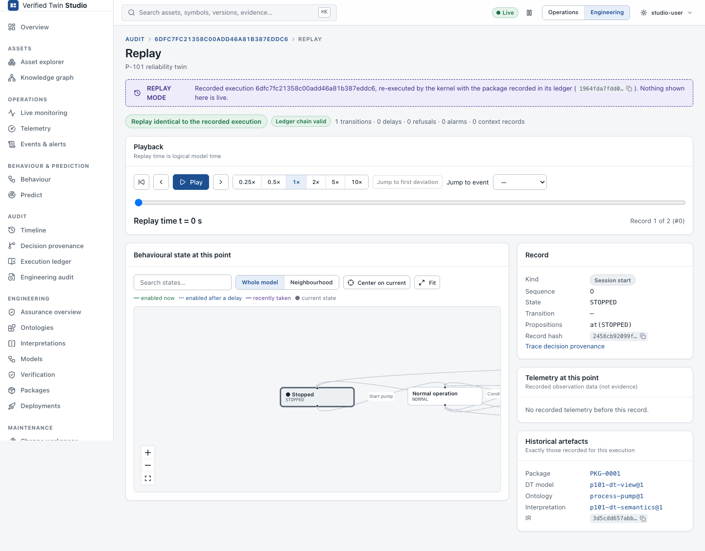

# Tutorial: Safely evolving an ontology

This tutorial takes the industrial pump P-101 through one complete engineering loop: from the
published ontology to a new deployed package. At the end, it checks that an old execution
still replays with the semantics it used at the time.

**The scenario.** The pump vendor issued datasheet revision C:
- the rated speed is now fixed at 2980 rpm (it was "at most 3600 rpm")
- the bearing housing gets lube-oil temperature supervision, with an alarm limit of 80 °C

We want the twin's domain knowledge to reflect this without silently changing what the
running twin means.

The screenshots come from the running product. `scripts/capture-screenshots.sh` regenerates
them on an isolated stack by running exactly these steps
(`scripts/screenshots/tutorial.mjs`). The identifiers below (v3, EV-…, CHG-…, PKG-0003) are
those of a freshly seeded demo; yours may differ.

You need the demo running (`./scripts/start-demo.sh`) and Studio open in
**Engineering** mode.

---

## 1. Open the published ontology

Go to **Engineering → Ontologies → Process pump domain**, then open **v1**: the version
deployed on twin *P-101 reliability twin*.



The banner says that the version **is published and immutable**. The editor is read-only.
**Dependencies** shows that both P-101 interpretations and the deployment use it, and
**History** shows its lineage. There is also a **v2 (REJECTED)**: an earlier proposal that
raised the bearing alarm limit to 95 °C. Its refinement check failed. Open its evidence to see
a counter-model.

## 2. Create a draft

First create a change workspace for the twin: **Maintenance → Change workspace → New change**,
twin *P-101 reliability twin*, title *Datasheet revision C*. Then, back on v1, click **Create draft from v1**. Enter a change
description and attach the draft to the change.



Studio creates **v3** in state **DRAFT**, with v1 as its parent. v1 is unchanged.

## 3. Edit, save, and read the diagnostics

Edit the text. In this example, the alarm-limit axiom is first typed with a misspelled
symbol:

```
axiom lube_limit_val : (= lube_oil_limit 80)
```

**Save draft** stores the text and runs the strict parser:



`ONT007` points at the exact location: `lube_oil_limit` is not declared. Saving never
validates, publishes or deploys anything; it only stores your work. Complete the revision as
in `examples/industrial-pump/evolution/process-pump-v2.ont`:

```diff
+fun lube_oil_temp       : Temperature  ; measured lube-oil sump temperature
+fun lube_oil_temp_limit : Temperature  ; lube-oil alarm limit (datasheet rev C)
-axiom rated_speed_bound : (<= rated_speed 3600)
+axiom rated_speed_bound : (= rated_speed 2980)
+axiom lube_limit_val    : (= lube_oil_temp_limit 80)
+axiom lube_below_brg    : (<= lube_oil_temp_limit bearing_temp_limit)
+axiom nn_lube           : (>= lube_oil_temp (- 40))
```

Save again. The diagnostics clear.

## 4. Validate

**Validate** runs, in the backend:
- the strict parser
- SemPTDTAlignmentICSE's own parser, cross-checked against the strict parser (both must see
  the same signature)
- Z3, to check that the axioms are consistent



The version becomes **VERIFIED**, and the validation evidence names the checker: Z3 version,
aligner commit and format. **Publish** is now enabled. Do **not** publish yet: inside a change,
publishing happens at release, after the remaining evidence exists.

## 5. Compare with the deployed version

**Compare** opens the version comparison, v1 → v3:



The **semantic diff** lists two functions added, `rated_speed_bound` modified and three axioms
added. Studio also lists *symbols whose meaning may change* and the **interpretation entries
that use them**: every P-101 location and event mentions `bearing_temp_limit` or
`rated_speed`. The source diff is below it.

The diff shows what changed. It cannot tell you whether the change is safe.

## 6. Run the refinement check

**Check refinement** → base `process-pump@1`, twin context *P-101 reliability twin* (so its
deployed interpretations are included) → **Run refinement check**.



The result is **VALID REFINEMENT**, with every condition of Definition 4 holding:
- **(a)** every v1 symbol still exists with the same sorts
- **(b)** the v3 axioms entail every v1 axiom. For example, `(= rated_speed 2980)` entails
  `(<= rated_speed 3600)`.
- **(c.P), (c.D)** every PT and DT interpretation entry has the same meaning under the new axioms

All 43 obligations were discharged by Z3. The report also lists the assumptions, the hashes
of both ontologies and the checker identity. It is stored as evidence (EV-…).

Compare this with v2: it changed `bearing_temp_limit` from 90 to 95, so axiom
`temp_limit_val` of v1 is violated (condition (b)). Its report shows the counter-model
`bearing_temp_limit = 95`, and the verdict is **NOT A REFINEMENT**.

## 7. Inspect the impact

**Analyze impact** answers: if v3 replaced v1, what would be affected?



- **Interpretations** `p101-pt-semantics@1` and `p101-dt-semantics@1`: **Preserved**, because
  condition (c) holds. The refinement evidence is cited.
- **Alignment** of the P-101 twin: **Preserved (Theorem 3)**. Φ′ ⊑ Φ was established
  together with the interpretations, and the deployed views were aligned under Φ, so they are
  aligned under Φ′. Both evidence records are cited.
- **Twin IR**: **Unaffected**. The IR depends only on the DT view and the DT interpretation.
- **Package** and **deployment**: the package is immutable, so a new one must be built. The
  current deployment keeps running v1 until a new package is deployed.

Had the check been NOT A REFINEMENT, or run without interpretations, the alignment would show
**Requires verification** and *Required next steps* would ask for realignment.

## 8. Resolve the required verification and build the package

Open the change (**Maintenance → Change workspace → Datasheet revision C**). The release
pipeline is computed from stored evidence for exactly these artefacts:



Run the remaining stages:
- **Check / re-check alignment**: passes *via Theorem 3*, citing the refinement evidence and
  the original alignment evidence. No realignment is needed.
- **Compile DT view**: Twin IR, with translation validation.
- **Build verified package**: PKG-0003, with 50 integrity checks.
- **Verify package**: integrity verified now.

The pipeline then reports **Ready to release**.

## 9. Release and deploy

**Release** publishes v3, which becomes immutable, marks PKG-0003 as released and closes the
change. Deployment is a separate, explicit step: **Deploy** PKG-0003 to the P-101 twin with a
reason.



**Engineering → Deployments** shows the append-only history: the initial deployment of
PKG-0001, then PKG-0003 with its reason and actor. **Maintenance → Rollback** could return to
PKG-0001 at any time (a reason is required), without deleting anything newer.

## 10. Old executions keep their semantics

Open **Audit → Execution ledger**, select the P-101 twin and replay its **oldest** execution.



The **Historical artefacts** panel shows **PKG-0001, `process-pump@1`, `p101-dt-semantics@1`**:
the package recorded in that execution's ledger. The runtime replays it with exactly that
package. The replay is **identical to the recorded execution** and the ledger chain is valid,
although v3 is deployed now. History is never reinterpreted with today's ontology.

---

## What you did

| Question | Where you answered it |
|---|---|
| Which ontology is this twin using, which exact version? | Asset page → *Defined by*; Engineering → Deployments |
| Can I create a new version? Is my draft valid? | Create draft → Validate (step 2–4) |
| What changed? | Compare (step 5) |
| Is it a valid refinement, and who decided? | Refinement evidence (step 6): Z3 + aligner, with checker identity |
| Does the old alignment remain valid? If not, why? | Impact (step 7): Theorem 3, or *Requires verification* with reasons |
| What must I rerun? Can I release? | Pipeline (step 8) |
| Which artefacts are deployed? Can I roll back? | Deployments and Rollback (step 9) |
| Can I reproduce an old execution with its exact semantics? | Replay → Historical artefacts (step 10) |
