# Tutorial: Build Your First Twin

You will build a **Simple Thermal Chamber** twin from nothing — a laboratory heating chamber with
an electric heater, a door sensor and an air-temperature probe, protected by an over-temperature
latch — verify it, release it, run an instance of it and watch its monitors in Operate. Every
verdict on the way comes from the backend: the validators, the aligner, the compiler, the
semantic kernel and the runtime.

All the content used below is in `examples/thermal-chamber`:
[`blueprint.json`](../../examples/thermal-chamber/blueprint.json) (the sections) and `models/` —
the timed automata [`chamber_pt.xml`](../../examples/thermal-chamber/models/chamber_pt.xml) and
[`chamber_dt.tta.json`](../../examples/thermal-chamber/models/chamber_dt.tta.json), the ontology
[`thermal-chamber.ont`](../../examples/thermal-chamber/models/thermal-chamber.ont) and the
interpretations [`pt.interp`](../../examples/thermal-chamber/models/pt.interp) and
[`dt.interp`](../../examples/thermal-chamber/models/dt.interp). Type it into the editors, or
import the files where an editor offers **Import**. The screenshots were taken from the running product
(`scripts/screenshots/first-twin.mjs`).

Start the product (`./scripts/start-demo.sh`) and open <http://localhost:8080>.

## 1. Start a new Blueprint

**Studio → New Blueprint**, choose **Blank Blueprint**, then **Next: identity**.

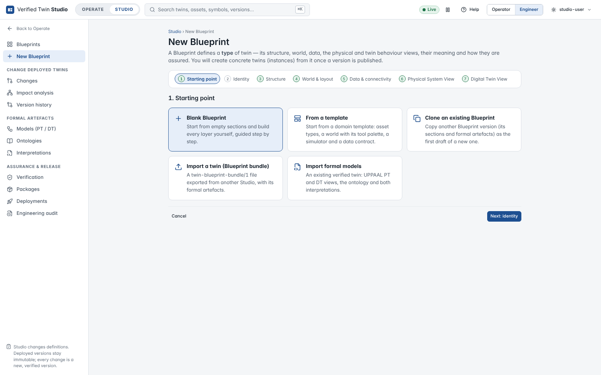

## 2. Identity

Name **Simple Thermal Chamber**, id `thermal-chamber`, domain `lab`, icon *thermometer*, a short
description. Keep **Monitoring** (the twin follows the controller's events), time unit
**seconds** and 1000 ticks per second (millisecond-exact logical time). **Create and continue
(guided)** creates draft **v1** on the server and opens the guided flow at step 3.

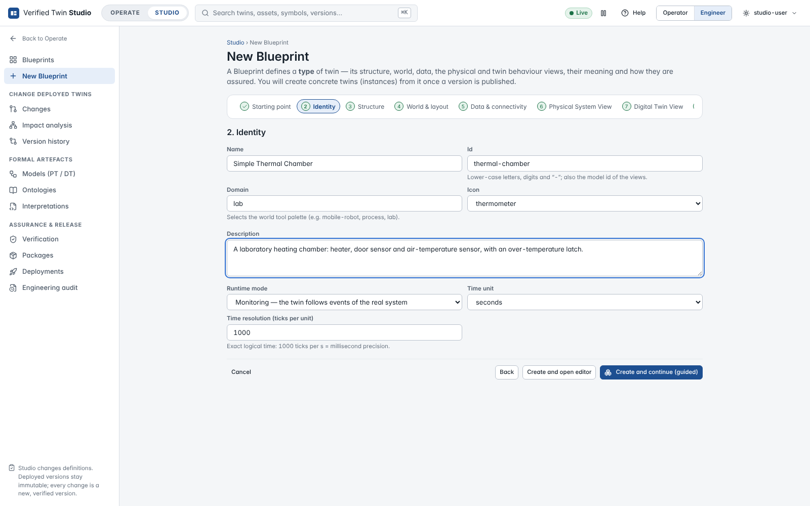

## 3. Structure

In **Asset types** add *Laboratory*, *ThermalChamber*, *Heater*, *DoorSensor* and
*TemperatureSensor* (a type can declare properties, e.g. the chamber's volume). In **Assets**:

| Asset | Type | Scope | Parent |
|---|---|---|---|
| `lab` — Materials lab M-2 | Laboratory | **context** (shared, bound per instance) | — |
| `chamber` — Thermal chamber | ThermalChamber | instance · **root** | lab |
| `heater` | Heater | instance | chamber |
| `door-sensor` | DoorSensor | instance | chamber |
| `temp-sensor` | TemperatureSensor | instance | chamber |

and three **relationships**: heater *heats* chamber, door-sensor *monitors* chamber, temp-sensor
*measures* chamber. The wizard bar shows where you are; **Next** moves on, **Skip** leaves a step
for later, **Save and exit** leaves the flow (everything is already saved).

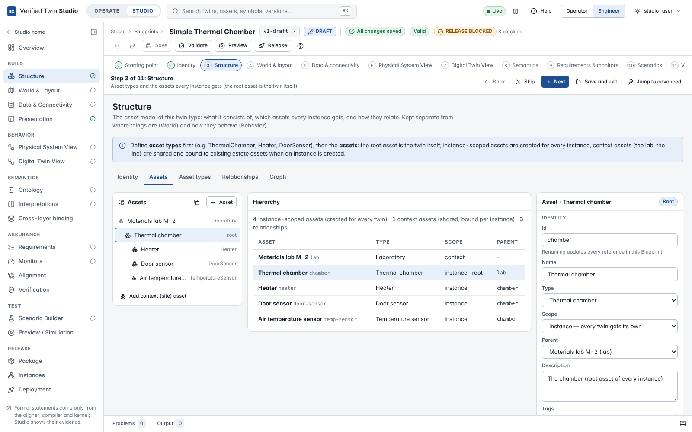

## 4. World & layout

A spatial world of 3 m × 2 m: draw the lab floor, the chamber body, the heater element and the
door as rectangles and the probe as a point (layers *room*, *equipment*, *notes*), and bind each
object to its asset in the inspector. This is where the chamber is; it does not change what the
twin does.

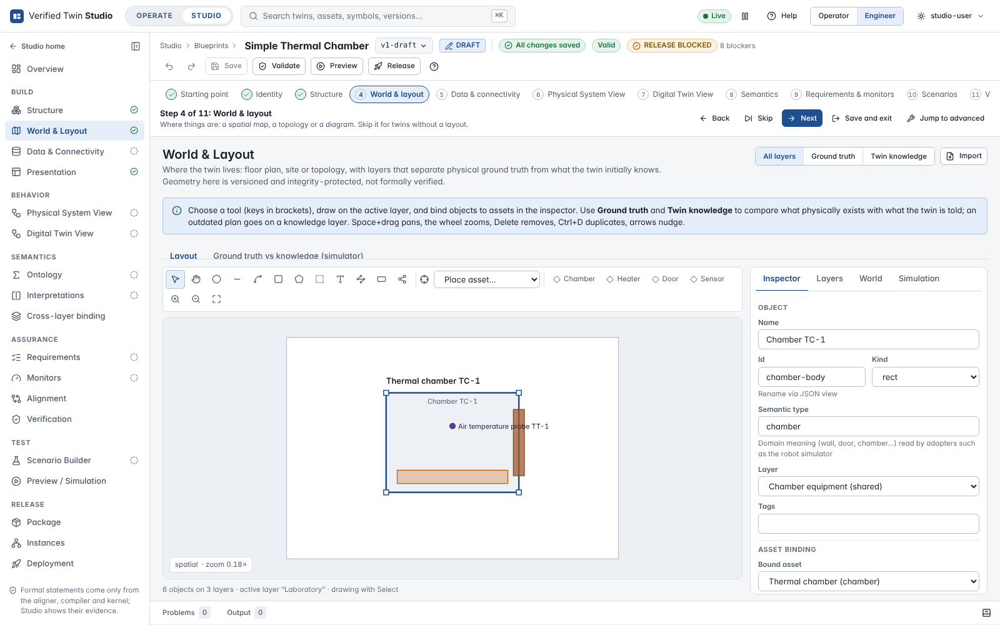

## 5. Data & connectivity

Signals: `temperature` (real, degC, asset temp-sensor, plausible −40…200, ontology symbol
`temperature`), `heater_on` and `door_open` (boolean, symbols `heater_on` and `door_open`).
Events, each with its labels in both views: *Heating started* (`heater_on!` / `start_heating!`),
*Heating stopped* (`heater_off!` / `stop_heating!`), *Over-temperature* (`overheat!` /
`high_temperature!`), *Latch reset* (`latch_reset!` / `cooled_down!`). Command: *Reset
over-temperature latch*. Under **Connectivity**, a *simulator* source (the controller's event
script) and a binding for each signal.

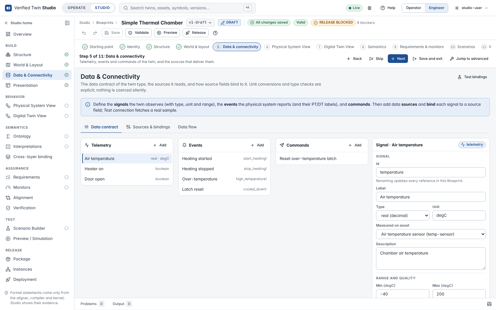

## 6. Physical System View

**Behavior → Physical System View → Import** `models/chamber_pt.xml` — the controller's UPPAAL
model: `IDLE`, `HEATING` (invariant `x <= 600`) and `OVERHEATED`, with `latch_reset!` guarded by
`x >= 30`. Studio converts it to its canonical model on the server; a construct outside the
supported fragment would be listed and nothing imported.

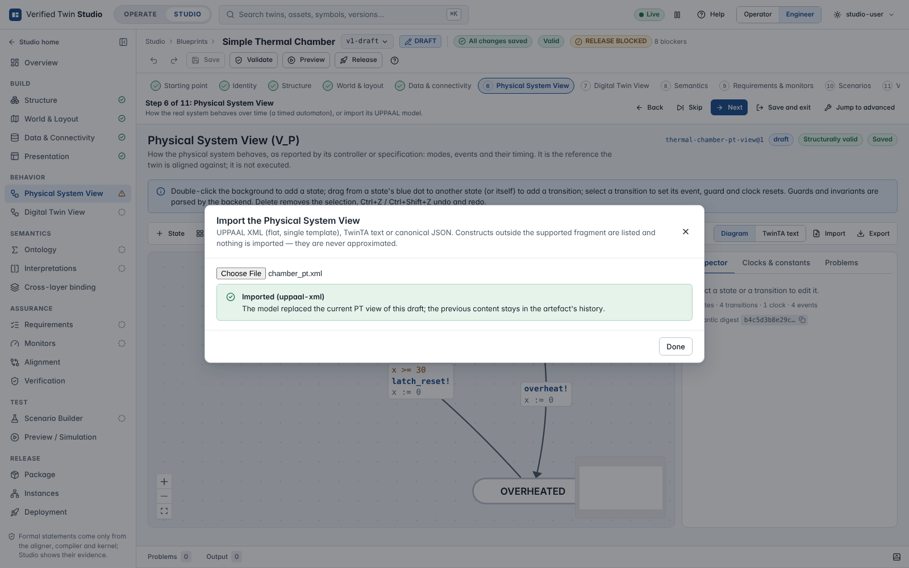

## 7. Digital Twin View

The twin's own view, with its own vocabulary: `IDLE`, `HEATING` (`t <= 600`), `OVERHEATED`, and
`cooled_down!` allowed only when `t >= 30`. Draw it (double-click the canvas for a location, drag
from a location's handle for a transition, edit guards and resets in the inspector) or import
`models/chamber_dt.tta.json`.

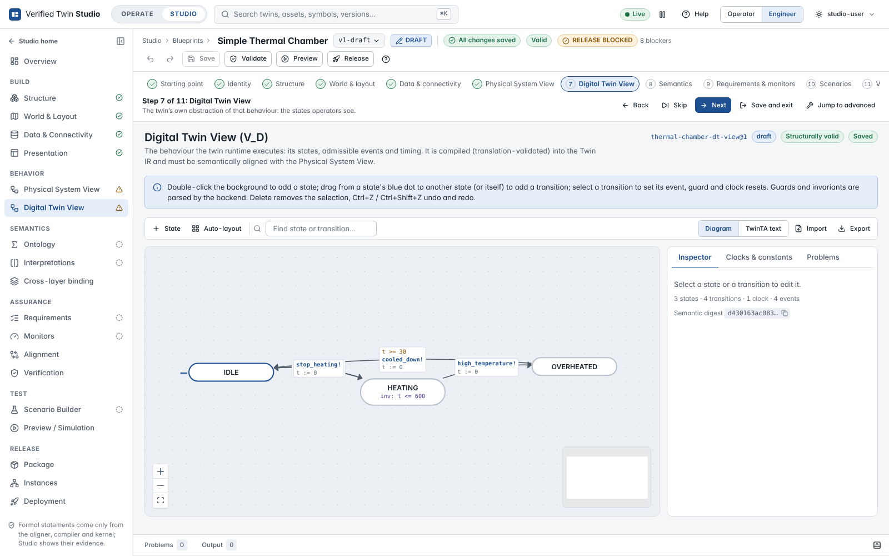

## 8. Ontology

**Semantics → Ontology**: the domain theory shared by both views — sort `Temperature`, functions
`temperature`, `temperature_limit`, `setpoint`, relations `heater_on`, `door_open`,
`reset_requested`, and axioms such as `(= temperature_limit 80)` and
`(< setpoint temperature_limit)`. Type it or **Import file** `models/thermal-chamber.ont`; the
strict parser checks it as you type.

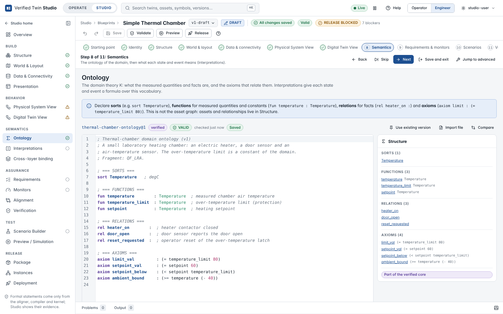

## 9. Interpretations

What each state and event *means*, in the ontology's terms. For the Digital Twin View (I_D):

```
IDLE        : (and (not heater_on) (<= temperature temperature_limit))
HEATING     : (and heater_on (not door_open) (<= temperature temperature_limit))
OVERHEATED  : (and (not heater_on) (> temperature temperature_limit))
high_temperature! : (> temperature temperature_limit)
cooled_down!      : (and reset_requested (<= temperature temperature_limit))
```

and the same meanings for the controller's own names (I_P, `models/pt.interp`). **Coverage** shows
every state and event mapped.

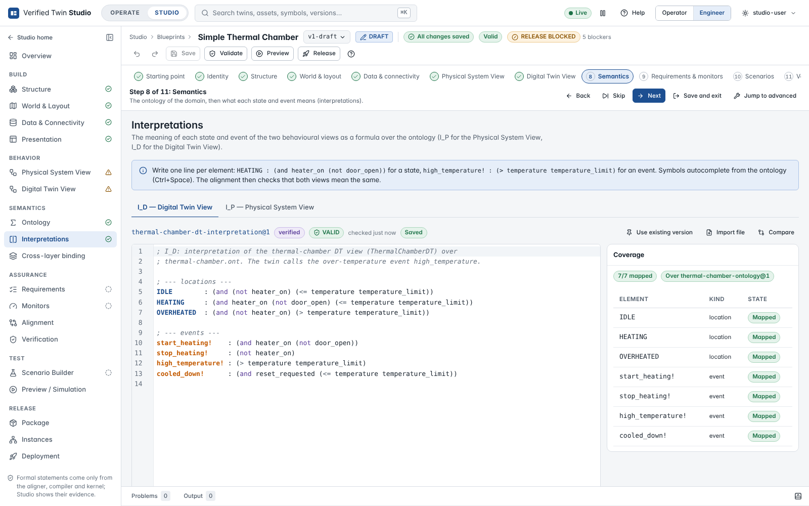

## 10. Check the chain across layers

**Semantics → Cross-layer binding** reads every signal and event from the world through the data
contract and the ontology to the states and events that use it. Nothing is highlighted: each
chain is complete.

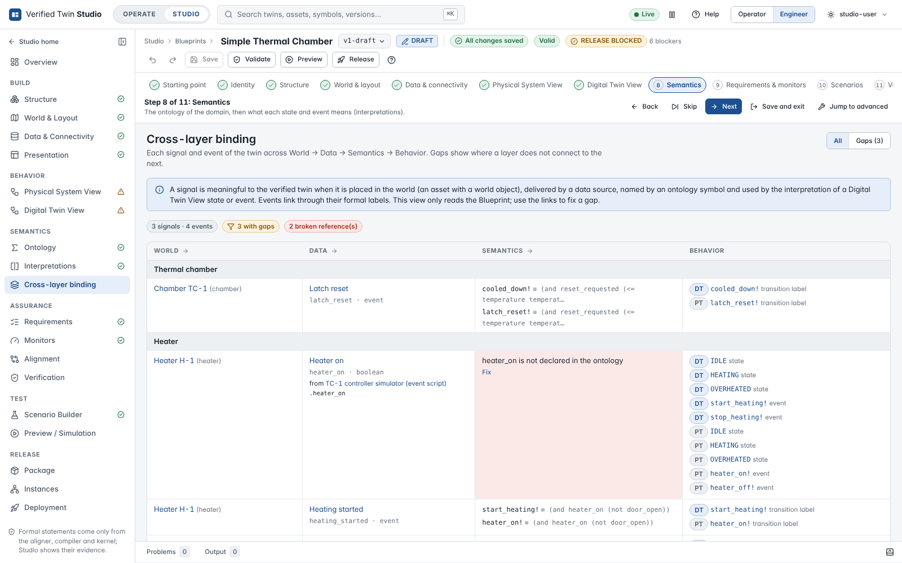

## 11. Requirements and 12. monitors

Requirements: *Chamber never overheats* (safety, `A[] !OVERHEATED`), *Cool down at least 30 s*
(timing), *Controller events conform*, *Fresh temperature*. Monitors: behavioural conformance,
the property `A[] !OVERHEATED`, *Heating at most 10 min* (`A[] (HEATING -> t <= 600)`), and two
data-quality monitors on `temperature` (stale after 30 s, outside −40…200). The alert policy
raises an alert when conformance or the overheating monitor is violated and when the temperature
is stale.

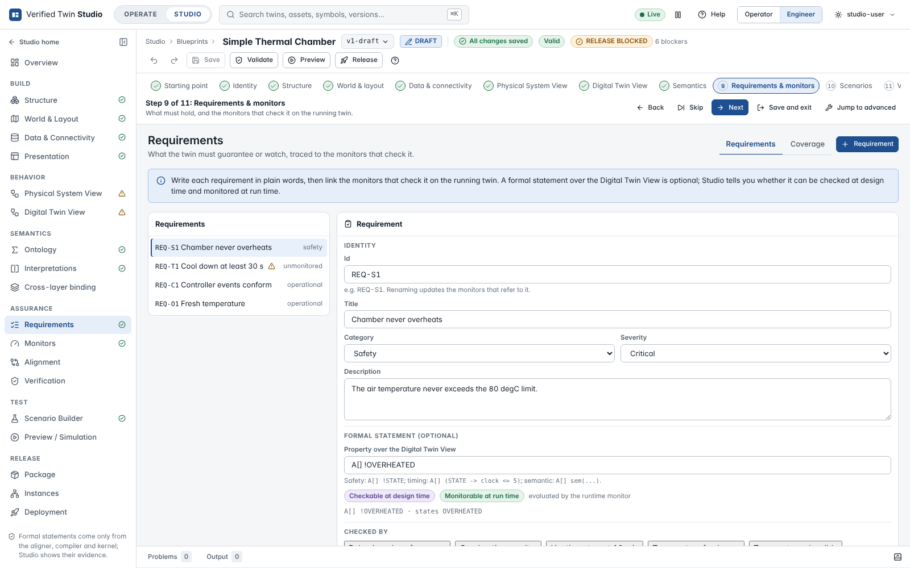

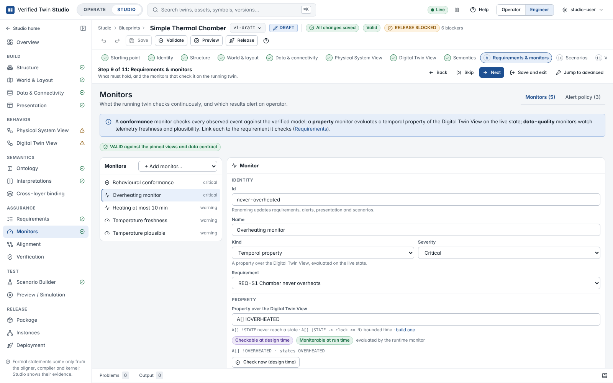

## 13. Run all checks

**Assurance → Verification → Run all checks**: the five artefacts are validated, the Digital Twin
View is compiled (with translation validation), the aligner checks that it is a faithful
abstraction of the controller's view under the ontology, and the scenarios run on the kernel.
The headline turns **VERIFIED**.

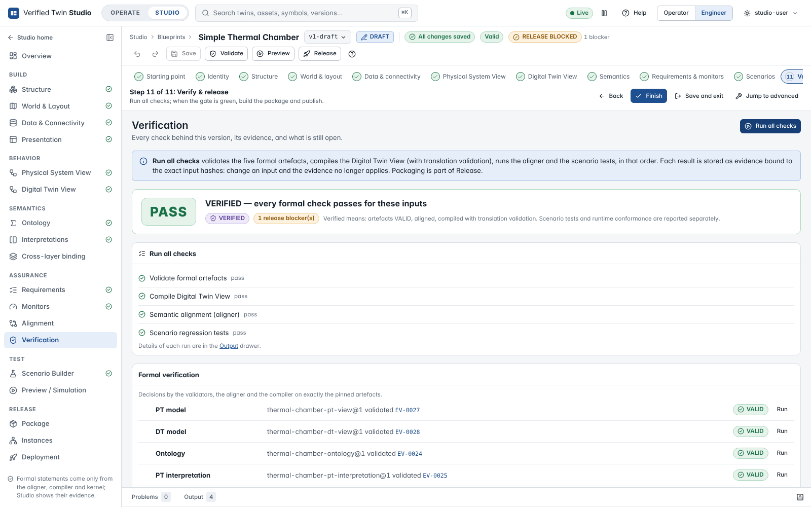

## 14. Read the alignment

**Assurance → Alignment**: **PASS — STRONG** (neither view has internal transitions), the label
equivalence the aligner found (`heater_on!` ≡ `start_heating!`, `overheat!` ≡
`high_temperature!`, `latch_reset!` ≡ `cooled_down!`…), the hashes of exactly what was checked,
the aligner's identity and the run's duration.

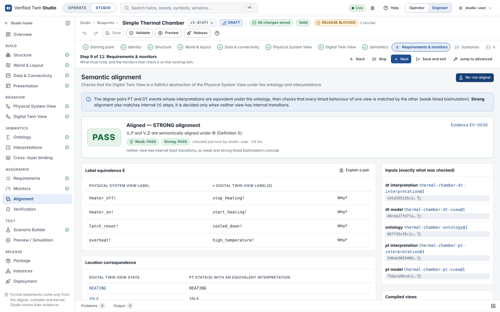

## 15. A scenario

**Test → Scenario Builder → Reset before cool-down**: heating starts at t = 5, the over-temperature
event comes at t = 100, and resetting at t = 110 is marked as a step the model must **refuse**.
**Run scenario**: PASS — the kernel refused the early reset, as the guard `t >= 30` demands. Try
adding `cooled_down!` at t = 110 yourself: the builder refuses it, explains *too early: the
earliest permitted time is t = 130*, and offers **Move to earliest legal time (t = 130)**.

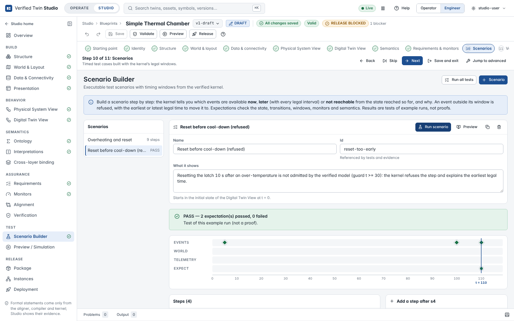

## 16. Release

**Release → Package → Build package & bundle**. The gate turns **READY TO RELEASE**: the Verified
Core Package (formally verified) and the Deployment Bundle (integrity-protected) are built. Then
**Publish v1** — v1 becomes immutable.

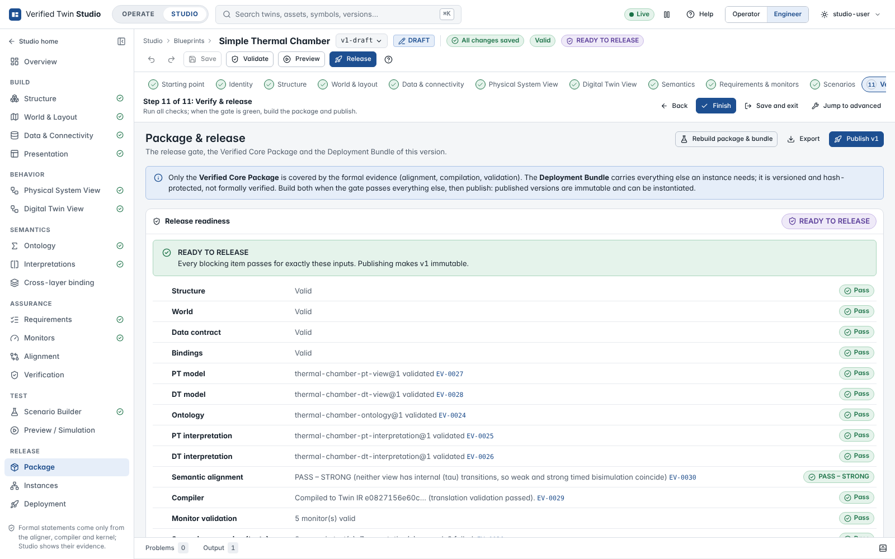

## 17. An instance

**Release → Instances → New instance**: id `chamber-tc1-dt`, name *Chamber TC-1*, the chamber's
asset id `chamber-tc1`, and bind the shared lab to the estate's `lab-m2`.

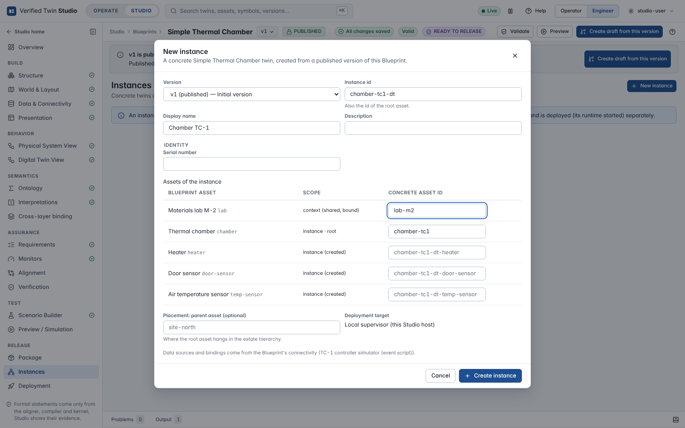

## 18. Deploy

**Deploy now**: the supervisor starts the runtime on v1's package with the controller's event
script; the instance is **DEPLOYED · RUNNING**.

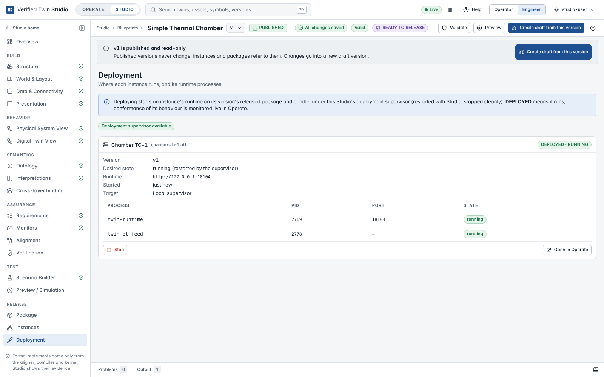

## 19. Operate it

**Open in Operate**: Chamber TC-1 is live — its state, signals and verification come from its
runtime.

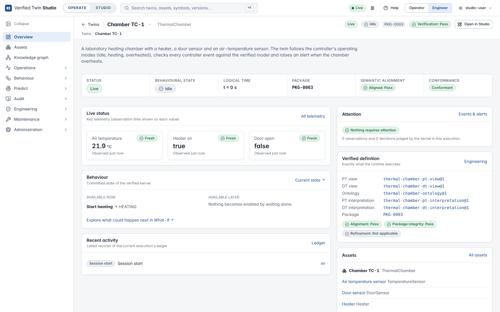

## 20. Watch its monitors

**Behaviour → Monitors**: every monitor evaluated live by its authority — conformance by the
runtime, the properties on the kernel's state, data quality on the stored telemetry — the alerts
raised now and the status of each requirement.


## What next

- Change a state's label in **Presentation** in a new draft: **Impact** shows that no formal
  evidence is affected.
- Change the cool-down guard in the Digital Twin View: alignment and compilation become stale and
  the release gate blocks until they are re-run.
- Read [Twin Blueprints](blueprints.md), [the Blueprint workspace](blueprint-workspace.md),
  [scenarios and preview](scenarios-and-preview.md) and
  [release, instances and deployment](blueprint-release.md).
